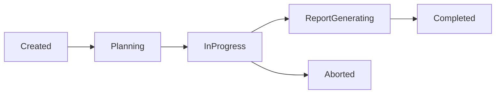
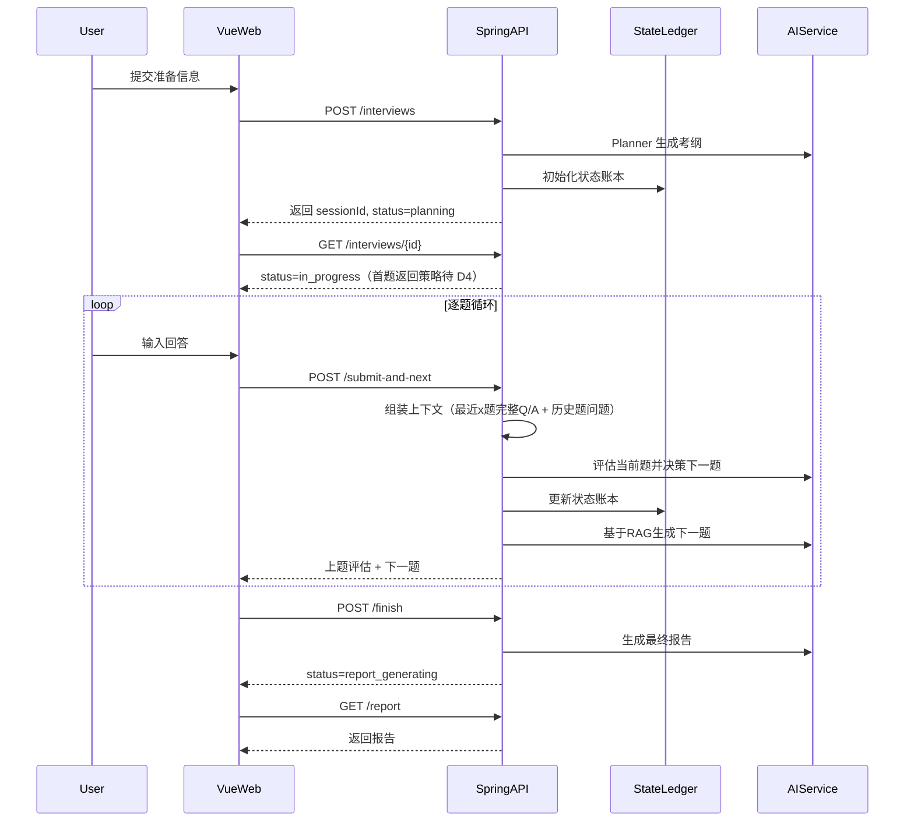

# AI 模拟面试系统 API 草案

## 1. 设计原则

- 统一使用 REST 风格接口。
- 所有接口以 `/api/v1` 为前缀。
- 除注册、登录、验证码发送外，其余接口默认需要登录。
- 大模型调用必须由后端统一封装，前端不直接访问模型服务。
- 面试主链路采用“提交并继续”，由服务端一次完成保存答案、AI 评估、状态更新和下一题生成。
- API 文档同时覆盖 MVP 和非 MVP 接口，非 MVP 接口会明确标注 `[非MVP]`。

### 1.1 核心枚举口径

- `targetRole`: `JAVA_BACKEND | GO_BACKEND | DATA_ENGINEER | FRONTEND | QA | DEVOPS`
- `experienceLevel`: `JUNIOR | MIDDLE | SENIOR | STAFF`
- `questionType`: `INTRO | PROJECT_DEEP_DIVE | SCENARIO | PRINCIPLE | BEHAVIORAL`
- `depthLevel`: `L1 | L2 | L3 | L4 | L5`
- `mode`: `practice | professional`
- `answerMode`: `text | voice`

## 2. 通用响应格式

```json
{
  "code": 0,
  "message": "OK",
  "data": {},
  "traceId": "2f2f7a8f4c564ce3a7cbf94d4b9c37f0"
}
```

约定：

- `code = 0` 表示成功。
- 非 `0` 表示业务错误。
- `traceId` 用于日志追踪。

## 3. 鉴权与账户接口

### 3.1 注册 `[MVP]`

`POST /api/v1/auth/register`

流程：先调用「发送邮箱验证码」且 `scene=register`（此时会校验邮箱未注册），用户收到验证码后，再调用本接口提交邮箱、验证码、昵称、密码完成注册。

请求体：

```json
{
  "email": "user@example.com",
  "code": "123456",
  "nickname": "alice",
  "password": "StrongPass123"
}
```

### 3.2 邮箱密码登录 `[MVP]`

`POST /api/v1/auth/login/password`

请求体：

```json
{
  "email": "user@example.com",
  "password": "StrongPass123"
}
```

### 3.3 发送邮箱验证码 `[MVP]`

`POST /api/v1/auth/email-code/send`

- `scene=login`：登录用验证码，不校验是否已注册。
- `scene=register`：注册用验证码，**仅当该邮箱未注册时**才发送，否则返回「该邮箱已注册」。

请求体：

```json
{
  "email": "user@example.com",
  "scene": "login"
}
```

或注册场景：

```json
{
  "email": "user@example.com",
  "scene": "register"
}
```

返回：`data` 为对象。**开发环境**（未配置 `SEND_EMAIL`）时 `data.devCode` 为本次验证码，前端可直接展示或回填，无需查收邮件；生产环境 `data.devCode` 为 null。

### 3.4 邮箱验证码登录 `[MVP]`

`POST /api/v1/auth/login/email-code`

请求体：

```json
{
  "email": "user@example.com",
  "code": "123456"
}
```

### 3.5 发送手机验证码 `[非MVP]`

`POST /api/v1/auth/phone-code/send`

请求体：

```json
{
  "phone": "13800000000",
  "scene": "login"
}
```

说明：

- 当前仅预留能力，MVP 不接入手机验证码登录链路。
- 后续阶段可以接短信服务，也可以在开发环境走 mock 通道。

### 3.6 手机验证码登录 `[非MVP]`

`POST /api/v1/auth/login/phone-code`

请求体：

```json
{
  "phone": "13800000000",
  "code": "123456"
}
```

### 3.7 获取当前用户信息 `[MVP]`

`GET /api/v1/auth/me`

### 3.8 退出登录 `[MVP]`

`POST /api/v1/auth/logout`

## 4. 系统与设备检测接口

### 4.1 网络延迟探测 `[MVP]`

`GET /api/v1/system/ping`

返回体：

> 注：以下示例按“首题内嵌返回”写法展示，最终以 D4 决策为准。

```json
{
  "code": 0,
  "message": "OK",
  "data": {
    "serverTime": "2026-03-07T10:00:00Z"
  }
}
```

说明：

- 前端通过请求往返时间计算 Ping。
- 摄像头预览、麦克风波形、扬声器测试主要由浏览器 API 完成，不强依赖后端接口。

### 4.2 环境合规检测 `[非MVP]`

`POST /api/v1/system/environment-check`

说明：

- 后续用于 AI 面容检测、环境光检测等。

## 5. 简历管理接口

### 5.1 获取简历列表 `[MVP]`

`GET /api/v1/resumes`

返回体：

```json
{
  "code": 0,
  "message": "OK",
  "data": [
    {
      "id": 9001,
      "name": "张三_Java开发.pdf",
      "sourceType": "file",
      "parseStatus": "parsed",
      "isDefault": true,
      "createdAt": "2026-03-07T09:00:00Z"
    }
  ]
}
```

### 5.2 上传简历并发起解析 `[MVP]`

`POST /api/v1/resumes/upload`

说明：

- `multipart/form-data`
- 后端保存原文件并异步解析文本。
- MVP 仅支持文件上传创建简历，不支持“纯文本直接创建简历”。

返回体：

```json
{
  "code": 0,
  "message": "OK",
  "data": {
    "resumeId": 9001,
    "parseStatus": "parsing"
  }
}
```

### 5.3 查询简历解析状态 `[MVP]`

`GET /api/v1/resumes/{resumeId}/parse-status`

返回体：

```json
{
  "code": 0,
  "message": "OK",
  "data": {
    "resumeId": 9001,
    "parseStatus": "parsed",
    "parsedTextPreview": "3年 Java 后端开发经验，负责订单系统..."
  }
}
```

### 5.4 获取简历详情 `[MVP]`

`GET /api/v1/resumes/{resumeId}`

### 5.5 更新简历识别文本 `[MVP]`

`PUT /api/v1/resumes/{resumeId}`

请求体：

```json
{
  "name": "张三_Java开发_优化版",
  "parsedText": "3年 Java 后端开发经验，负责订单系统优化...",
  "isDefault": true
}
```

### 5.6 设为默认简历 `[MVP]`

`POST /api/v1/resumes/{resumeId}/set-default`

### 5.7 删除简历 `[MVP]`

`DELETE /api/v1/resumes/{resumeId}`

## 6. 岗位与知识域接口

### 6.1 获取岗位列表 `[MVP]`

`GET /api/v1/positions`

### 6.2 获取岗位知识域树 `[MVP]`

`GET /api/v1/positions/{positionCode}/skill-domains`

返回体：

```json
{
  "code": 0,
  "message": "OK",
  "data": [
    {
      "domainId": 1,
      "domainCode": "java_basics",
      "domainName": "Java 语言基础"
    },
    {
      "domainId": 2,
      "domainCode": "concurrency",
      "domainName": "并发编程"
    }
  ]
}
```

### 6.3 获取个性化音色列表 `[非MVP]`

`GET /api/v1/voices`

## 7. 面试会话与主流程接口

### 7.1 创建面试 `[MVP]`

`POST /api/v1/interviews`

说明：

- 用于在准备页提交岗位、年限、JD、简历和模式设置。
- 服务端创建 `interview_session` 后异步调用 AI Planner 生成考纲并初始化状态账本。
- 若未显式传 `rememberSettings` 或其值为 `true`，会同步保存用户的最近一次面试偏好（默认记忆开启）。
- 本场题量由后端 AI 决策与内置规则共同控制，前端不传 `maxQuestionCount`。
- 主考纲中会包含题型配额、知识域 `domain_id`、项目锚点等信息，供后续动态出题使用。

请求体：

```json
{
  "targetRole": "JAVA_BACKEND",
  "experienceLevel": "SENIOR",
  "mode": "professional",
  "jobDescription": "负责 Spring Boot 微服务开发...",
  "resumeId": 9001,
  "focusTopics": "我想重点学习redis",
  "rememberSettings": true,
  "thinkTimeLimitSeconds": 30,
  "answerTimeLimitSeconds": 180
}
```

返回体：

```json
{
  "code": 0,
  "message": "OK",
  "data": {
    "sessionId": 3001,
    "status": "planning"
  }
}
```

### 7.2 获取面试详情与首题 `[MVP]`

`GET /api/v1/interviews/{sessionId}`

说明：

- Loading 页轮询该接口。
- 当状态进入 `in_progress` 时，至少返回会话可开始状态；首题是“内嵌返回”还是“面试页单独拉取”将在 D4 决策后统一定稿。

返回体：

```json
{
  "code": 0,
  "message": "OK",
  "data": {
    "id": 3001,
    "title": "Java 后端开发模拟面试",
    "targetRole": "JAVA_BACKEND",
    "experienceLevel": "SENIOR",
    "mode": "professional",
    "currentQuestionNo": 1,
    "status": "in_progress",
    "syllabusSummary": {
      "plannedDomains": [
        "Java 语言基础",
        "并发编程",
        "数据库原理",
        "缓存与中间件"
      ]
    },
    "currentQuestion": {
      "questionId": 5001,
      "questionNo": 1,
      "questionType": "PROJECT_DEEP_DIVE",
      "domainId": 4,
      "domainName": "缓存与中间件",
      "stem": "请介绍一个你负责过的高并发项目，以及你在其中解决过的技术难点。",
      "targetSkill": "项目经验表达",
      "targetDepth": "L3",
      "hintAvailable": true
    }
  }
}
```

### 7.3 提交并继续 `[MVP]`

`POST /api/v1/interviews/{sessionId}/submit-and-next`

说明：

核心定位：处理用户单道题目的最终提交，并以打字机流式效果（SSE）返回评估结果和下一题。

特征工程前置：本接口不接收任何原始音频流。前端需提前完成语音转文本（STT），并负责计算用户的“停顿”、“卡壳”时长，将这些特征以纯文本标签（如 [停顿 2.5s]）的形式揉进 answerText 中一并提交。

协议说明：采用 text/event-stream 协议。前端需使用 fetch 配合 ReadableStream 进行调用，不可使用传统的 Axios 拦截器处理。

- 这是主链路核心接口。
- 服务端串行完成：保存答案 -> 按固定窗口组装上下文 -> 评估当前题并决策下一题 -> 更新状态账本 -> 判断是否结束 -> 生成下一题。
- 为避免重复提交，前端必须传 `clientRequestId` 作为幂等键。
- 专业模式下仅允许 `answerMode=voice`；练习模式支持 `text` 或 `voice`。
- AI 上下文规则固定：
  - 最近 `x` 题读取完整 `Q/A`
  - 更早历史题仅传问题文本
  - 再加上本次回答、主考纲、当前状态账本
- 当前不引入能力快照，也不做重型 patch 冲突处理；同一会话按串行方式处理。

请求体：

```json
{
  "clientRequestId": "a8e5c8a4-8f1f-4b1b-9ef2-97a0f603d8f3",
  "questionId": 5001,
  "answerMode": "voice",
  "answerText": "我参与过订单系统改造，主要负责缓存设计和接口性能优化...",
  "transcriptText": "我主要负责了那个订单系统的改造，[停顿 2.5s] 嗯... 核心难点是缓存穿透，我用了 [停顿 1.2s] 布隆过滤器来拦截恶意请求。",
  "audioFileUrl": "https://cdn.example.com/interview/3001/5001.wav",
  "elapsedSeconds": 96,
  "speechSpeedWpm": 120
}
```

返回体（继续出题）：
返回的不再是单一 JSON，而是一系列流式事件。前端需监听特定的 event 类型

```json
// 1. 确认接收，后端开始调 AI 评估（立即返回，0延迟感）
event: status
data: {"code": 0, "message": "已接收答案，考官正在思考..."}

// 2. 评估结果生成完毕（打包返回上一题得分与评语）
event: assessment
data: {"questionId": 5001, "score": 75, "briefComment": "技术点命中布隆过滤器，能够说明基本用途，但对误判率控制和工程取舍的说明还不够完整。"}

// 3. 决定出下一题，下发下一题的元数据（前端可据此切换UI状态）
event: next_question_meta
data: {"questionId": 5002, "questionNo": 2, "questionType": "PRINCIPLE", "domainId": 2, "domainName": "并发编程", "targetSkill": "锁机制", "targetDepth": "L4"}

// 4. 下一题题干流式输出（高频触发，打字机效果）
event: next_question_chunk
data: {"text": "那"}

event: next_question_chunk
data: {"text": "么，"}

event: next_question_chunk
data: {"text": "请讲一下 Redis 分布式锁..."}

// 5. 流程结束标识
event: flow_end
data: {"isFinished": false, "message": "下一题出题完毕"}
```
(注：如果大模型判断考纲已覆盖完毕，不需要出下一题了，event: assessment 之后直接接 event: flow_end，且 isFinished 为 true。)

返回体（系统判定应结束）：

```json
{
  "code": 0,
  "message": "OK",
  "data": {
    "answeredQuestion": {
      "questionId": 5008,
      "score": 85,
      "briefComment": "对 Spring AOP 的原理解释准确到位。"
    },
    "nextQuestion": null,
    "interviewShouldEnd": true,
    "endReason": "syllabus_covered"
  }
}
```

### 7.4 跳过本题并继续 `[MVP]`

`POST /api/v1/interviews/{sessionId}/questions/{questionId}/skip-and-next`

说明：

- 跳过时不做 AI 评分，直接更新题目状态为 `skipped` 并生成下一题。

### 7.5 获取提示 `[MVP]`

`POST /api/v1/interviews/{sessionId}/hint`

请求体：

```json
{
  "questionId": 5001
}
```

### 7.6 结束面试 `[MVP]`

`POST /api/v1/interviews/{sessionId}/finish`

说明：

- 用户主动结束或系统建议结束后调用。
- 服务端生成最终报告，并更新用户长期知识域档案。

### 7.7 获取历史面试列表 `[MVP]`

`GET /api/v1/interviews?page=1&pageSize=10&status=completed`

### 7.8 获取单场面试原始逐字稿 `[MVP]`

`GET /api/v1/interviews/{sessionId}/transcript`

### 7.9 保存面试准备偏好 `[MVP]`

`PUT /api/v1/interview-preferences/latest`

说明：

- 供准备页“设置记忆功能”使用。

### 7.10 读取最近一次面试偏好 `[MVP]`

`GET /api/v1/interview-preferences/latest`

## 8. 报告与单题复盘接口

### 8.1 获取面试报告 `[MVP]`

`GET /api/v1/interviews/{sessionId}/report`

返回体：

```json
{
  "code": 0,
  "message": "OK",
  "data": {
    "sessionId": 3001,
    "overallScore": 78.5,
    "skillDomainScores": [
      {
        "domainId": 1,
        "domainName": "Java 语言基础",
        "score": 85,
        "note": "泛型和集合框架掌握较好"
      }
    ],
    "comprehensiveRadarScores": {
      "communication": 73,
      "logic": 79,
      "stability": 75,
      "expression": 76,
      "adaptability": 82
    },
    "summary": "整体基础扎实，但并发编程原理和缓存边界细节仍有提升空间。",
    "strengths": [
      "项目背景描述清楚"
    ],
    "weaknesses": [
      "并发编程底层原理展开不足"
    ],
    "improvementSuggestions": [
      "补强 JMM 和锁优化相关知识"
    ],
    "recommendedTopics": [
      "JMM 内存模型",
      "缓存一致性"
    ]
  }
}
```

说明：

- `comprehensiveRadarScores` 在练习模式下可为空，在专业模式下必须返回。

### 8.2 获取单题详情 `[MVP]`

`GET /api/v1/interviews/{sessionId}/questions/{questionId}`

### 8.3 单题向 AI 追问 `[MVP]`

`POST /api/v1/interviews/{sessionId}/questions/{questionId}/ai-consult`

请求体：

```json
{
  "message": "为什么这题我在缓存击穿这里失分了？"
}
```

### 8.4 获取单题 AI 追问历史 `[MVP]`

`GET /api/v1/interviews/{sessionId}/questions/{questionId}/ai-consult`

## 9. 成长问答库接口

### 9.1 收藏题目到问答库 `[MVP]`

`POST /api/v1/question-bank`

请求体：

```json
{
  "questionId": 5001,
  "sessionId": 3001,
  "tag": "缓存"
}
```

### 9.2 获取问答库列表 `[MVP]`

`GET /api/v1/question-bank?page=1&pageSize=20&tag=缓存&minScore=60&sortBy=createdAt`

### 9.3 删除问答库题目 `[MVP]`

`DELETE /api/v1/question-bank/{itemId}`

### 9.4 生成重做题目的预填参数 `[MVP]`

`GET /api/v1/question-bank/{itemId}/redo-context`

说明：

- 前端据此跳转到准备页并自动填入 `auto_focus`、`auto_mode`、`auto_target_role`。

## 10. 成长中心与用户资料接口

### 10.1 获取个人资料 `[MVP]`

`GET /api/v1/profile`

### 10.2 更新个人资料 `[MVP]`

`PUT /api/v1/profile`

请求体：

```json
{
  "nickname": "alice",
  "email": "user@example.com"
}
```

### 10.3 上传头像 `[MVP]`

`POST /api/v1/profile/avatar`

### 10.4 获取成长统计 `[MVP]`

`GET /api/v1/profile/statistics?positionCode=java_backend`

返回体：

```json
{
  "code": 0,
  "message": "OK",
  "data": {
    "totalSessions": 12,
    "totalMinutes": 420,
    "averageScore": 77.8,
    "scoreTrend": [
      {
        "date": "2026-03-01",
        "score": 71
      },
      {
        "date": "2026-03-07",
        "score": 82
      }
    ]
  }
}
```

### 10.5 获取知识域成长视图 `[MVP]`

`GET /api/v1/profile/skill-overview?positionCode=java_backend`

说明：

- 用于成长雷达图和“薄弱知识域快捷练习入口”。

### 10.6 获取技术能力红黑榜 Top3 `[非MVP]`

`GET /api/v1/profile/top3?positionCode=java_backend`

说明：

- 该接口本阶段先保留，数据基础可由 `user_skill_profiles` 提供，展示层后置。

### 10.7 获取历史平均残影雷达图 `[非MVP]`

`GET /api/v1/profile/radar-comparison?positionCode=java_backend`

## 11. 专业模式语音相关接口

### 11.1 浏览器前端语音识别 `[MVP]`

说明：

- MVP 默认使用浏览器 Web Speech API，不依赖后端接口。

### 11.2 后端实时语音转写 `[非MVP]`

`POST /api/v1/speech/asr`

### 11.3 AI 语音播报 `[非MVP]`

`POST /api/v1/speech/tts`

## 12. 管理端与运营接口

### 12.1 仪表盘统计 `[非MVP]`

`GET /api/v1/admin/dashboard`

返回内容建议包含：

- 当前活跃面试房间数
- 今日新增用户
- 最近 7 天用户增长趋势
- 今日面试场次
- 最近 7 天面试场次趋势
- 总用户数

### 12.2 模型健康状态 `[非MVP]`

`GET /api/v1/admin/model-health`

### 12.3 Prompt 列表 `[非MVP]`

`GET /api/v1/admin/prompts`

### 12.4 更新 Prompt `[非MVP]`

`PUT /api/v1/admin/prompts/{promptCode}`

### 12.5 上传 RAG 语料 `[非MVP]`

`POST /api/v1/admin/rag/documents`

### 12.6 查询 RAG 向量化进度 `[非MVP]`

`GET /api/v1/admin/rag/documents/{documentId}/status`

## 13. 状态机建议

### 13.1 会话状态流转



### 13.2 主流程时序



## 14. 业务错误码建议

| 错误码 | 说明 |
| --- | --- |
| `1001` | 参数校验失败 |
| `1002` | 未登录或登录态失效 |
| `1003` | 验证码错误或已过期 |
| `2001` | 面试会话不存在 |
| `2002` | 面试状态不允许当前操作 |
| `2003` | 当前题目不存在 |
| `2004` | 当前题目已提交回答 |
| `2005` | 考纲生成中，请稍后重试 |
| `2006` | 面试已达结束条件 |
| `2007` | 幂等请求重复提交 |
| `3001` | AI 服务调用失败 |
| `3002` | 报告仍在生成中 |
| `4001` | 简历解析失败 |

## 15. 后端模块拆分建议

- `auth`：注册、验证码、登录、Token 刷新。
- `system`：Ping、环境检测。
- `resume`：简历上传、解析、编辑、默认设置。
- `position`：岗位配置和知识域树管理。
- `interview`：会话、题目、答题、历史记录。
- `interview.engine`：状态账本、上下文窗口组装、出题决策、模式差异化控制、熔断扩展点。
- `report`：整场报告、单题复盘、AI 追问、知识域得分累积。
- `questionBank`：收藏题目、检索、重做。
- `profile`：个人资料、统计、成长雷达图、Top3 扩展。
- `ai`：模型适配层、Prompt 模板、知识库检索接口、日志与限流。
- `admin`：仪表盘、Prompt 管理、RAG 管理、模型监控。
