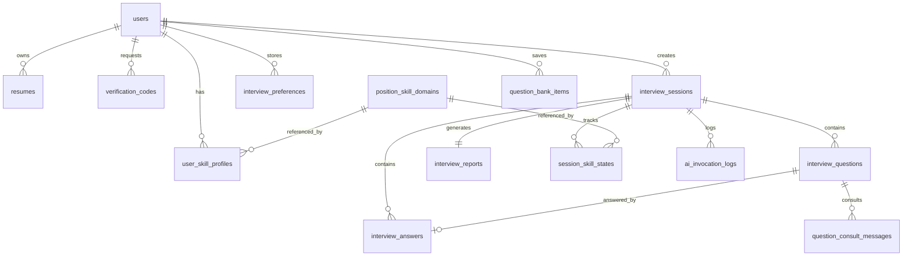

# AI 模拟面试系统核心数据模型

## 1. 设计目标

- 能完整保存一次面试全过程，包括考纲、逐题动态出题记录、实时评估结果和最终报告。
- 能同时支持练习模式和专业模式。
- 能支持简历上传、异步解析、编辑确认和多份简历管理。
- 能支持邮箱验证码登录、邮箱密码登录，并预留手机号验证码登录能力。
- 能按知识域维度累积用户长期技术档案。
- 能为红黑榜 Top3、熔断规则、RAG、语音能力预留扩展位。
- 能记录 AI 调用过程，便于复盘、调优和排障。

## 2. 核心实体关系

## 3. 枚举建议

### 3.1 会话状态 `session_status`

- `created`
- `planning`
- `in_progress`
- `report_generating`
- `completed`
- `aborted`

### 3.2 题目状态 `question_status`

- `pending`
- `asked`
- `answered`
- `skipped`

### 3.3 回答方式 `answer_mode`

- `text`
- `voice`

### 3.4 面试模式 `interview_mode`

- `practice`
- `professional`

### 3.5 简历解析状态 `resume_parse_status`

- `pending`
- `parsing`
- `parsed`
- `failed`

### 3.6 验证码发送通道 `verification_channel`

- `email`
- `phone`

### 3.7 知识域考察状态 `skill_state_status`

- `uncovered`
- `in_progress`
- `covered`
- `circuit_broken`

### 3.8 岗位枚举 `target_role`

- `JAVA_BACKEND`
- `GO_BACKEND`
- `DATA_ENGINEER`
- `FRONTEND`
- `QA`
- `DEVOPS`

### 3.9 工作年限分层 `experience_level`

- `JUNIOR`
- `MIDDLE`
- `SENIOR`
- `STAFF`

### 3.10 深度等级 `depth_level`

- `L1`
- `L2`
- `L3`
- `L4`
- `L5`

### 3.11 题目类型 `question_type`

- `INTRO`
- `PROJECT_DEEP_DIVE`
- `SCENARIO`
- `PRINCIPLE`
- `BEHAVIORAL`

## 4. 表结构

### 4.1 `users`

| 字段 | 类型 | 说明 |
| --- | --- | --- |
| `id` | bigint pk | 用户主键 |
| `email` | varchar(128) unique null | 邮箱 |
| `phone` | varchar(32) unique null | 手机号 |
| `password_hash` | varchar(255) null | 密码哈希 |
| `nickname` | varchar(64) | 昵称 |
| `avatar_url` | varchar(255) null | 头像地址 |
| `email_verified` | tinyint | 邮箱是否验证 |
| `phone_verified` | tinyint | 手机号是否验证 |
| `status` | varchar(32) | 账户状态 |
| `created_at` | datetime | 创建时间 |
| `updated_at` | datetime | 更新时间 |

索引建议：

- `uk_users_email(email)`
- `uk_users_phone(phone)`

### 4.2 `verification_codes`

| 字段 | 类型 | 说明 |
| --- | --- | --- |
| `id` | bigint pk | 主键 |
| `user_id` | bigint null | 关联用户，可为空 |
| `channel` | varchar(32) | 邮箱或手机 |
| `target` | varchar(128) | 邮箱地址或手机号 |
| `scene` | varchar(32) | 使用场景，如 `login` |
| `code_hash` | varchar(255) | 验证码哈希 |
| `status` | varchar(32) | `sent` / `used` / `expired` |
| `expires_at` | datetime | 过期时间 |
| `created_at` | datetime | 创建时间 |

### 4.3 `resumes`

| 字段 | 类型 | 说明 |
| --- | --- | --- |
| `id` | bigint pk | 简历主键 |
| `user_id` | bigint | 所属用户 |
| `name` | varchar(128) | 简历名称 |
| `source_type` | varchar(32) | `file`（MVP）/ `text`（预留） |
| `original_file_name` | varchar(255) null | 原始文件名 |
| `original_file_url` | varchar(255) null | 原始文件地址 |
| `parse_status` | varchar(32) | 简历解析状态 |
| `parse_error_message` | varchar(255) null | 解析失败原因 |
| `raw_text` | longtext null | 原始提取文本 |
| `parsed_text` | longtext | 用户确认后的可用文本 |
| `is_default` | tinyint | 是否默认简历 |
| `created_at` | datetime | 创建时间 |
| `updated_at` | datetime | 更新时间 |

说明：

- MVP 即支持“上传文件 -> 异步解析 -> 用户修改识别文本 -> 保存”。
- `parsed_text` 是最终供面试使用的简历文本。

### 4.4 `position_skill_domains`

| 字段 | 类型 | 说明 |
| --- | --- | --- |
| `id` | bigint pk | 知识域主键 |
| `position_code` | varchar(64) | 岗位编码，取值需对齐 `target_role` 枚举 |
| `position_name` | varchar(128) | 岗位名称 |
| `version` | int | 知识域定义版本 |
| `domain_code` | varchar(64) | 知识域编码 |
| `domain_name` | varchar(128) | 知识域名称 |
| `description` | varchar(255) null | 知识域说明 |
| `sort_order` | int | 排序序号 |
| `created_at` | datetime | 创建时间 |
| `updated_at` | datetime | 更新时间 |

说明：

- 增加 `version`，便于未来调整知识域树时兼容历史报告和长期档案。

### 4.5 `interview_preferences`

| 字段 | 类型 | 说明 |
| --- | --- | --- |
| `id` | bigint pk | 主键 |
| `user_id` | bigint | 用户 ID |
| `target_role` | varchar(64) | 最近岗位枚举 |
| `experience_level` | varchar(32) | 最近工作年限分层枚举 |
| `mode` | varchar(32) | 最近模式 |
| `focus_topics` | varchar(512) null | 最近侧重点 |
| `think_time_limit_seconds` | int null | 最近思考时间限制 |
| `answer_time_limit_seconds` | int null | 最近回答时间限制 |
| `updated_at` | datetime | 更新时间 |

### 4.6 `interview_sessions`

| 字段 | 类型 | 说明 |
| --- | --- | --- |
| `id` | bigint pk | 面试会话主键 |
| `user_id` | bigint | 用户 ID |
| `resume_id` | bigint null | 关联简历 |
| `title` | varchar(255) | 本场标题 |
| `target_role` | varchar(64) | 目标岗位枚举 |
| `position_domain_version` | int | 本场采用的岗位知识域版本 |
| `experience_level` | varchar(32) | 工作年限分层枚举 |
| `mode` | varchar(32) | 面试模式 |
| `job_description` | longtext | JD 文本 |
| `focus_topics` | varchar(512) null | 用户指定侧重点 |
| `current_question_no` | int | 当前题号 |
| `context_window_size` | int | 最近完整 `Q/A` 的窗口大小 x |
| `think_time_limit_seconds` | int null | 专业模式思考时间限制 |
| `answer_time_limit_seconds` | int null | 专业模式回答时间限制 |
| `first_question_json` | json null | 第一题快照（是否在 Loading 阶段生成，待 D4 决策） |
| `syllabus_json` | json null | Planner 生成的主考纲 |
| `state_ledger_json` | json null | 状态账本 |
| `status` | varchar(32) | 会话状态 |
| `model_provider` | varchar(64) | 模型供应商 |
| `model_name` | varchar(128) | 模型名称 |
| `started_at` | datetime null | 开始时间 |
| `finished_at` | datetime null | 完成时间 |
| `created_at` | datetime | 创建时间 |
| `updated_at` | datetime | 更新时间 |

说明：

- `first_question_json` 作为首题快照预留；是否由 `GET /interviews/{id}` 直接返回首题待 D4 决策。
- `syllabus_json` 需包含题型配额、知识域目标深度、项目锚点等规划信息。
- `state_ledger_json` 是唯一过程状态表达，负责记录知识域覆盖、题型进度、当前项目锚点等信息。
- `context_window_size` 用于固定“最近 x 题完整 `Q/A`，历史题仅问题文本”的上下文窗口规则。

### 4.7 `session_skill_states`

| 字段 | 类型 | 说明 |
| --- | --- | --- |
| `id` | bigint pk | 主键 |
| `session_id` | bigint | 所属面试会话 |
| `domain_id` | bigint | 关联知识域 |
| `status` | varchar(32) | 考察状态 |
| `tested_count` | int | 被考察题数 |
| `target_depth` | varchar(16) | 目标深度等级 |
| `current_depth` | varchar(16) null | 当前已达到的深度等级 |
| `saturated` | tinyint | 是否已问透 |
| `evidence_refs` | json null | 相关题目 ID 列表 |
| `ai_notes` | text null | AI 对该知识域的定性备注 |
| `created_at` | datetime | 创建时间 |
| `updated_at` | datetime | 更新时间 |

说明：

- 保留 `circuit_broken` 状态，为后续熔断策略预留扩展位。
- MVP 阶段不触发熔断，但数据结构先保留。

### 4.8 `interview_questions`

| 字段 | 类型 | 说明 |
| --- | --- | --- |
| `id` | bigint pk | 题目主键 |
| `session_id` | bigint | 所属面试会话 |
| `question_no` | int | 题号 |
| `question_type` | varchar(64) | 题目类型枚举 |
| `domain_id` | bigint null | 主知识域 |
| `secondary_domain_ids` | json null | 可选副知识域列表 |
| `project_id` | varchar(64) null | 若为项目深挖题，对应项目锚点 ID |
| `stem` | longtext | 题目内容 |
| `target_skill` | varchar(128) | 核心考察点 |
| `expected_points` | json | 理想回答要点 |
| `target_depth` | varchar(16) null | 本题目标深度等级 |
| `status` | varchar(32) | 题目状态 |
| `hint_text` | longtext null | 面试官提示 |
| `generation_context_json` | json null | 生成题目时的决策上下文 |
| `created_at` | datetime | 创建时间 |
| `updated_at` | datetime | 更新时间 |

### 4.9 `interview_answers`

| 字段 | 类型 | 说明 |
| --- | --- | --- |
| `id` | bigint pk | 回答主键 |
| `session_id` | bigint | 会话 ID |
| `question_id` | bigint | 题目 ID |
| `client_request_id` | varchar(64) | 提交并继续的幂等键 |
| `answer_mode` | varchar(32) | 文本或语音 |
| `answer_text` | longtext | 用户最终回答文本 |
| `transcript_text` | longtext null | 语音识别转写文本 |
| `audio_file_url` | varchar(255) null | 语音原始文件地址 |
| `speech_engine` | varchar(64) null | 语音识别引擎来源 |
| `think_elapsed_seconds` | int null | 思考耗时 |
| `answer_elapsed_seconds` | int null | 回答耗时 |
| `elapsed_seconds` | int null | 总耗时 |
| `is_skipped` | tinyint | 是否跳过 |
| `score` | decimal(5,2) null | 单题技术得分 |
| `commentary` | longtext null | AI 点评 |
| `strength_points` | json null | 亮点 |
| `weak_points` | json null | 薄弱点 |
| `evaluated_domains` | json null | 知识域评分明细 |
| `comprehensive_dimension_scores` | json null | 专业模式综合维度评分明细 |
| `ideal_answer_outline` | longtext null | 黄金答题骨架 |
| `rewritten_answer` | longtext null | 满分参考重构 |
| `highlighted_segments` | json null | 颜色批注片段 |
| `created_at` | datetime | 创建时间 |
| `updated_at` | datetime | 更新时间 |

说明：

- 练习模式主要使用 `score` 和 `evaluated_domains`。
- 专业模式额外使用 `comprehensive_dimension_scores`，例如沟通、逻辑、表达等。
- 不再单独存储 `confidence` 类字段，当前方案统一依赖状态账本和题目评估结果表达过程状态。

### 4.10 `interview_reports`

| 字段 | 类型 | 说明 |
| --- | --- | --- |
| `id` | bigint pk | 报告主键 |
| `session_id` | bigint unique | 对应面试会话 |
| `overall_score` | decimal(5,2) | 总分 |
| `skill_domain_scores` | json | 知识域维度评分列表 |
| `comprehensive_radar_scores` | json null | 专业模式综合能力雷达图数据 |
| `summary` | longtext | 总结评语 |
| `strengths` | json | 优势列表 |
| `weaknesses` | json | 薄弱点列表 |
| `improvement_suggestions` | json | 提升建议 |
| `recommended_topics` | json null | 推荐练习知识点 |
| `interactive_transcript_json` | json null | 互动式逐字稿 |
| `created_at` | datetime | 创建时间 |
| `updated_at` | datetime | 更新时间 |

说明：

- `comprehensive_radar_scores` 在练习模式可为空，在专业模式必填。
- `interactive_transcript_json` 用于反馈页逐字稿展示。

### 4.11 `question_consult_messages`

| 字段 | 类型 | 说明 |
| --- | --- | --- |
| `id` | bigint pk | 主键 |
| `session_id` | bigint | 面试会话 ID |
| `question_id` | bigint | 题目 ID |
| `user_id` | bigint | 用户 ID |
| `role` | varchar(32) | `user` / `assistant` |
| `content` | longtext | 消息内容 |
| `created_at` | datetime | 创建时间 |

说明：

- 承接问答详情页中的“询问 AI”功能。

### 4.12 `user_skill_profiles`

| 字段 | 类型 | 说明 |
| --- | --- | --- |
| `id` | bigint pk | 主键 |
| `user_id` | bigint | 用户 ID |
| `position_code` | varchar(64) | 岗位编码 |
| `domain_id` | bigint | 关联知识域 |
| `score` | decimal(5,2) | 累积加权得分 |
| `sample_count` | int | 累计被考察次数 |
| `last_tested_at` | datetime null | 最近一次考察时间 |
| `ai_summary` | text null | 最新 AI 定性总结 |
| `created_at` | datetime | 创建时间 |
| `updated_at` | datetime | 更新时间 |

说明：

- 成长中心页直接读取此表渲染雷达图与弱项快捷练习。
- 红黑榜 Top3 虽暂不展示，但数据基础来自此表。

### 4.13 `question_bank_items`

| 字段 | 类型 | 说明 |
| --- | --- | --- |
| `id` | bigint pk | 收藏记录主键 |
| `user_id` | bigint | 用户 ID |
| `question_id` | bigint | 题目 ID |
| `session_id` | bigint | 来源面试 |
| `domain_id` | bigint null | 题目主知识域 |
| `score` | decimal(5,2) null | 收藏时的单题得分 |
| `tag` | varchar(64) null | 用户标签 |
| `source_snapshot_json` | json null | 收藏时的题目快照 |
| `created_at` | datetime | 创建时间 |

说明：

- `source_snapshot_json` 用于题目被删除或历史结构变化时仍可展示收藏内容。

### 4.14 `ai_invocation_logs`

| 字段 | 类型 | 说明 |
| --- | --- | --- |
| `id` | bigint pk | 主键 |
| `session_id` | bigint null | 面试会话 ID |
| `question_id` | bigint null | 题目 ID |
| `user_id` | bigint null | 用户 ID |
| `prompt_code` | varchar(64) | Prompt 标识 |
| `prompt_version` | varchar(32) | Prompt 版本 |
| `model_provider` | varchar(64) | 模型供应商 |
| `model_name` | varchar(128) | 模型名称 |
| `temperature` | decimal(4,2) null | 温度 |
| `request_tokens` | int null | 输入 Token |
| `response_tokens` | int null | 输出 Token |
| `latency_ms` | int null | 延迟 |
| `retrieval_context_json` | json null | RAG 检索结果摘要 |
| `request_payload_json` | json null | 请求快照 |
| `response_payload_json` | json null | 响应快照 |
| `success` | tinyint | 是否成功 |
| `error_message` | varchar(255) null | 错误信息 |
| `created_at` | datetime | 创建时间 |

说明：

- 该表对后续调试动态出题、评分偏差、RAG 命中率非常关键，建议 MVP 就落库。

## 5. 建表顺序建议

1. `users`
2. `verification_codes`
3. `resumes`
4. `position_skill_domains`
5. `interview_preferences`
6. `interview_sessions`
7. `session_skill_states`
8. `interview_questions`
9. `interview_answers`
10. `interview_reports`
11. `question_consult_messages`
12. `user_skill_profiles`
13. `question_bank_items`
14. `ai_invocation_logs`

## 6. 关键约束

- 一场面试只能有一份最终报告。
- 每个题目最多只有一条有效回答记录。
- 同一 `client_request_id` 在同一场会话内只能成功处理一次。
- 题号在同一场会话内唯一。
- 每场会话中同一知识域最多一条 `session_skill_states` 记录。
- 删除会话建议采用软删除，避免历史报告丢失。
- 设置默认简历时，同一用户只能有一份 `is_default = 1` 的简历。

## 7. 推荐的审计字段

如果后端统一采用公共基类，建议所有表保留：

- `created_by`
- `updated_by`
- `deleted`

AI 相关表建议额外记录：

- `prompt_code`
- `prompt_version`
- `model_provider`
- `model_name`
