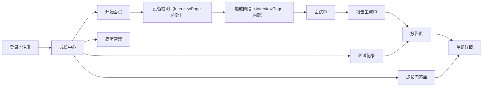
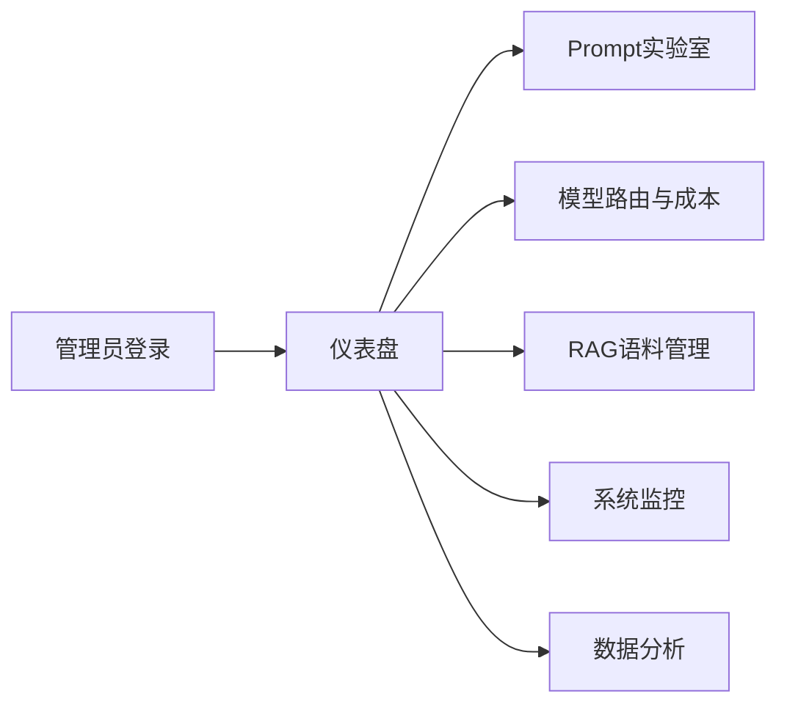

# 当前页面与状态流转

本文描述当前前端实际存在的页面入口和状态切换，不把历史上规划过但尚未独立落地的页面写成既成事实。

## 运行方式

- 根入口是 [frontend/src/App.vue](/D:/a05-cursor/frontend/src/App.vue)
- 当前没有 Vue Router
- 用户端页面通过 `currentPage` 和若干布尔状态切换
- 管理端页面通过 `AdminLayout` 内部 `currentPage` 切换

## 未登录态

根据状态显示以下页面之一：

- `LoginPage`
- `RegisterPage`
- `AdminLoginPage`

## 用户端主页面

侧栏页面由 [frontend/src/components/Sidebar.vue](/D:/a05-cursor/frontend/src/components/Sidebar.vue) 驱动：

| 状态值 | 对应组件 | 说明 |
| --- | --- | --- |
| `growth` | `GrowthCenterPage` | 默认首页，展示成长数据和快捷入口 |
| `interview` | `InterviewPage` | 面试准备、设备检测、加载、面试中的统一入口 |
| `history` | `HistoryPage` | 面试记录与报告入口 |
| `questionBank` | `QuestionBankPage` | 收藏题目与重做入口 |
| `resumes` | `ResumesPage` | 简历列表、上传、编辑、默认设置 |
| `analysis` | `AnalysisPage` | 当前存在的用户端数据分析页 |
| `settings` | `SettingsPage` | 个人设置 |

## 用户端临时页 / Overlay

这些页面不是侧栏独立入口，而是由状态切换显示：

| 状态 | 对应组件 | 触发场景 |
| --- | --- | --- |
| `showReportGeneratingPage` | `InterviewReportGeneratingPage` | 报告生成中 |
| `showResultPage` | `InterviewResultPage` | 查看整场报告 |
| `showQuestionDetail` | `QuestionDetailPage` | 查看单题详情或问答库详情 |
| `showRadarPage` | `RadarChartPage` | 成长维度雷达图 |
| `showScoreTrendPage` | `ScoreTrendPage` | 分数趋势图 |

## 面试页内部状态

[frontend/src/components/InterviewPage.vue](/D:/a05-cursor/frontend/src/components/InterviewPage.vue) 内部包含四段真实流程：

1. `面试准备`
   选择简历、岗位、工作年限、JD、面试模式、侧重知识点、压迫感、音色
2. `设备检测`
   摄像头、麦克风、扬声器、网络检测
3. `加载阶段`
   显示考纲生成与面试准备进度
4. `面试中`
   展示当前问题、输入区、SSE 下一题、TTS 播报、语音识别等

这意味着：

- 当前前端确实有“准备 / 设备检测 / 加载 / 面试中”这四段体验
- 但它们还没有拆成独立路由页面

## 管理端页面

管理员登录后进入 [frontend/src/components/AdminLayout.vue](/D:/a05-cursor/frontend/src/components/AdminLayout.vue)。

当前管理端页面状态如下：

| 状态值 | 对应组件 | 说明 |
| --- | --- | --- |
| `dashboard` | `AdminDashboard` | 仪表盘 |
| `prompt` | `PromptLab` | Prompt 实验室 |
| `model` | `ModelRouting` | 模型路由与成本 |
| `rag` | `RagManagement` | RAG 语料管理 |
| `monitor` | `SystemMonitor` | 系统监控 |
| `analysis` | `DataAnalysis` | 数据分析 |

## 当前状态流转

### 普通用户

### 管理员

## 当前页面文档边界

现阶段不应再把以下内容写成“当前页面事实”：

- 独立存在的 `/interview-test`、`/interviews/:id/loading` 等 Vue Router 页面
- 尚未接入的欢迎页或营销首页
- 已从文档迁出的旧版 `home` 页面设定

如果需要追溯这些历史方案，请看 [archive/README.md](/D:/a05-cursor/docs/archive/README.md)。
