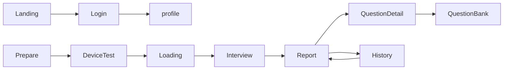

# AI 模拟面试系统 MVP 范围

## 1. 项目目标

本项目是一个前后端分离的网页端 AI 模拟面试系统。核心差异化能力是一个**具有状态感知能力的智能面试引擎**：

1. 用户注册或登录。
2. 用户填写岗位、年限、JD、简历等面试上下文，选择面试模式。
3. AI Planner 生成本次面试的专属主考纲（知识域优先级、题型配额、项目挖掘点、目标深度）。
4. 后端维护状态账本作为唯一过程状态表达，AI 根据用户每题回答实时评估并动态决定下一题的方向和深度。
5. 面试结束后生成结构化报告，将技术评价落库到用户的长期知识域档案。
6. 用户查看历史记录、薄弱点排行，并一键跳转靶向练习。

## 2. 当前冻结范围

### 2.1 产品边界

- 平台形态：仅网页端。
- 技术方向：前端 `Vue 3`，后端 `Spring Boot`。
- 架构模式：前后端分离。
- 出题模式：逐题动态生成，不预生成全部题目。AI 根据主考纲和状态账本控制面试节奏，用户无需手动控制题型配额。
- 面试模式：MVP 同时支持练习模式和专业模式（详见 7.2）。
- 语音实现：MVP 使用浏览器 Web Speech API 实现前端语音识别，后期支持调用大模型实现语音识别，后端 ASR 服务为非 MVP。
- 简历能力：MVP 支持文件上传，文件上传后自动解析为可编辑文本，用户确认后保存；文本粘贴创建简历能力后置。
- 后端服务层从第一天起设计为"知识库检索 + Prompt 拼接"两阶段结构，为后续 RAG 预留接口。
- 账户体系：MVP 支持邮箱注册、邮箱验证码登录、邮箱密码登录；手机号验证码登录和第三方登录后置（接口预留）。

### 2.2 MVP 成功标准

以下能力全部跑通，视为 MVP 可用：

- 用户可注册，并支持邮箱验证码登录与邮箱密码登录。
- 用户可管理多份简历（上传、解析、编辑、删除）。
- 用户可通过设备检测页验证摄像头、麦克风、扬声器和网络状态。
- 用户可发起一场新的模拟面试（练习模式或专业模式）。
- 系统可生成本次面试的专属考纲。
- 系统可根据主考纲和状态账本动态生成每一题。
- 用户提交回答后，服务端一次完成“固定窗口上下文组装 + 评估决策 + 状态更新 + 下一题生成”（提交并继续）。
- 用户可结束面试并生成结构化报告（含知识域维度评分）。
- 用户可查看历史面试列表、报告和单题详情，并在单题页向 AI 提问。
- 用户可将题目收藏到成长问答库，并在问答库中管理和二次练习。
- 成长中心页展示基本信息、成长雷达图和历史统计图表。

## 3. 目标用户

- 校招用户：准备前端、后端、测试、算法等岗位的技术面试。
- 社招用户：希望结合工作年限和 JD 做针对性模拟。
- 高频复盘用户：希望长期积累题目、错题和成长记录。

## 4. 核心用户流程

说明：

- `DeviceTest` 在准备页创建会话后进入，承担面试前设备和网络检测。
- `Loading` 阶段的核心动作是调用 AI Planner 生成主考纲并初始化状态账本；第一题是否在该阶段生成待 D4 最终决策。

## 5. 功能优先级

### 5.1 P0 必做

#### 账户与访问

- 邮箱注册。
- 邮箱验证码登录。
- 邮箱密码登录。
- 登录态保持与退出登录。

#### 设备检测

- 摄像头预览与检测。
- 麦克风音量动态波形检测。
- 扬声器音频播放测试。
- 网络实时延迟（Ping）显示。

#### 简历管理

- 文件上传（PDF/DOCX 等）。
- 后端解析为文本，前端展示识别结果。
- 用户可编辑识别后的文本并保存。
- 多份简历管理（创建、查看、编辑、删除）。
- 设置默认简历。

#### 面试准备

- 选择岗位方向。
- 选择工作年限。
- 选择面试模式（练习模式 / 专业模式）。
- 填写目标 JD。
- 选择简历内容。
- 练习模式可选：填写侧重知识点。
- URL 参数预填支持（用于碎片化练习跳转）。

#### 面试执行（练习模式）

- 创建面试会话并生成专属考纲。
- AI 根据主考纲和状态账本动态生成每一题。
- 展示当前题目与历史问答列表。
- 文本输入回答。
- 提交并继续（服务端一次完成：保存答案 + 组装固定上下文窗口 + AI 评估并决策 + 更新状态账本 + 生成下一题）。
- 跳过本题并继续。
- 获取面试官提示。
- 结束面试。
- 自动保存所有答题记录。

#### 面试执行（专业模式）

- 在练习模式基础上增加：
  - 语音输入（前端使用 Web Speech API，实时识别为文字，后期转为大模型，为语音状态打分）。
  - 每题思考时间倒计时（用户查看题目后开始计时）。
  - 每题回答时间倒计时（开始回答后计时）。
  - 计入全维度评分（技术分 + 沟通、逻辑等综合维度）。

#### AI 形象与界面

- AI 面试官静态形象展示。
- 用户摄像头画面展示（需通过设备检测）。

#### 结果与复盘

- 生成综合得分。
- 练习模式生成知识域维度评分。
- 专业模式生成知识域维度评分和综合能力雷达图。
- 生成面试总结评语和互动式逐字稿。
- 生成知识薄弱点和改进建议。
- 单题颜色批注（亮点/薄弱点高亮）。
- 单题评分、黄金答题骨架、满分参考重构。
- 单题页面内向 AI 追问功能。
- 将题目收藏到成长问答库。
- 将本次知识域得分累积更新到用户长期技术档案。
- 查看历史面试列表（评分、岗位、日期）。
- 查看单场报告和单题详情。

#### 成长问答库

- 题目列表卡片展示（题目内容、分数、来源面试）。
- 删除题目。
- 重做题目（跳转至以该题为侧重的面试准备页）。
- 按时间、标签、分数筛选排序。

#### 成长中心

- 头像、昵称、基础资料展示（资料编辑统一在个人设置页）。
- 知识域能力条形图（按岗位筛选）。
- 累计模拟次数、总时长、平均分趋势折线图。

### 5.2 P1 应做

- 首页欢迎页与营销内容。
- 技术能力红黑榜 Top3（该能力在原始构想中属于重要展示，但因展示方案未定，本阶段仅保留数据基础与接口扩展位，展示层后置）。
- 历史平均残影雷达图对比。
- 综合得分进度条增长动效。

### 5.3 P2 后续迭代

- 手机号验证码登录。
- 熔断降级策略（架构已预留扩展位，MVP 不实现）。
- AI 语音播报（TTS）和后端 ASR 实时语音转写。
- 算法题代码编辑器。
- AI 动态形象（2D/3D 驱动）。
- 智能监考（录像、面部表情评估、作弊检测）。
- 环境监测（AI 面容与环境光合规性检测）。
- GitHub 登录。
- 后台管理端（仪表盘、Prompt 实验室、RAG 语料管理、模型成本监控）。

## 6. 页面范围

### 6.1 MVP 页面

- `登录页`
- `注册页`
- `面试测试页`
- `简历管理页`
- `面试准备页`
- `面试加载页`
- `面试练习页`
- `面试反馈页`
- `问答详情页`
- `历史面试页`
- `成长问答库页`
- `成长中心页`

### 6.2 非 MVP 页面

- `欢迎页`
- `管理端仪表盘`
- `Prompt 实验室`
- `RAG 语料管理`

## 7. MVP 业务规则

### 7.1 题量与结束条件

- 最大题量由后端 AI 决策与内置策略控制，前端不暴露配置项。
- 系统保证最少出 3 题。
- 面试可由以下任一条件触发结束：用户主动点击结束、达到系统内置题量与覆盖策略阈值、AI 判定考纲核心知识域已充分覆盖。
- 面试结束后统一生成整场报告。

### 7.2 两种面试模式对比

| 维度 | 练习模式 | 专业模式 |
| --- | --- | --- |
| 输入方式 | 文本/语音输入 | 只允许语音输入
| 时间限制 | 无倒计时 | 思考时间 + 回答时间各有限制 |
| 计分范围 | 仅技术得分 | 技术 + 沟通 + 逻辑等全维度 |
| 侧重知识点 | 支持自定义输入 | 由考纲决定 |

### 7.3 提交并继续规则

- 用户点击"提交并继续"后，服务端串行完成：保存答案 → 按固定窗口组装上下文 → AI 评估并决策 → 更新状态账本 → 生成下一题。
- 固定窗口规则：
  - 最近 `x` 题读取完整 `Q/A`
  - 更早历史题仅传问题文本
  - 再加上本次回答、主考纲、当前状态账本
- 接口返回：上题评估结果（分数 + 一句话点评）+ 下一题内容。
- 若判定面试应结束，接口返回 `interviewShouldEnd: true`，前端引导用户调用 finish 接口。
- 跳过本题时，服务端跳过 AI 评估直接生成下一题，该题标记为 `skipped`。
- 第一题返回策略（Loading 内嵌返回或面试页单独拉取）待 D4 最终决策。

### 7.4 熔断规则（架构预留，MVP 不实现）

- 数据模型中保留 `session_skill_states.status = 'circuit_broken'` 枚举值。
- 后端出题引擎预留熔断判断接口点，MVP 阶段该判断直接返回"不触发"。
- 后续可根据连续低分情况自动切换考察方向。

### 7.5 红黑榜 Top3（架构预留，MVP 不展示）

- `user_skill_profiles` 表在每场面试后照常更新数据。
- 成长中心页 MVP 展示雷达图和统计折线图，不展示 Top3 红黑榜卡片。
- P1 阶段根据数据积累和展示方案确定后实现。

### 7.6 数据保存

- 每题必须保留题干、考察知识域、标准考察点、用户回答（文本 + 语音模式下的识别文本）、AI 点评。
- 用户跳过某题时，系统保留题目记录并标记为 `skipped`，不做评估。
- 报告生成期间，面试会话状态切换为 `report_generating`。
- 所有 AI 调用必须记录 Prompt 版本、Token 消耗和延迟，落入 `ai_invocation_logs` 表。

## 8. 技术评价体系

### 8.1 知识域树

每个岗位方向下挂 6-10 个抽象知识域，不细化到具体技术产品：

- Java 后端开发：Java 语言基础、并发编程、数据库原理、缓存与中间件、框架原理、系统设计、网络与协议、工程实践
- 前端开发：HTML/CSS、JavaScript 语言、框架原理、工程化与构建、网络与安全、性能优化、浏览器原理

MVP 先硬编码 2-3 个岗位的知识域配置，后续通过管理后台维护。

岗位、年限分层、题型、深度等级在系统内统一采用枚举编码表达，展示层再映射为中文名称。

### 8.2 评分与累积

- 每题回答后，AI 将评估结果映射到知识域并给出分数。
- 单场面试结束时，各知识域取该场相关题目的加权平均分。
- 用户长期技术档案按加权移动平均更新（新场次权重高于旧场次）。

### 8.3 定性备注

AI 在知识域评分之外附带定性备注（如"对 Redis 持久化机制理解不足"），用于单题详情页复盘，Top3 展示层面只显示知识域名称和分数。

## 9. 非功能要求

- 所有关键接口需要登录态校验。
- 所有 AI 输出必须落库。
- 面试过程中的答题数据要支持断点恢复。
- 所有 AI 调用记录 Prompt 版本、模型、温度、Token、延迟。
- 后端 AI 服务层从第一天起预留知识库检索接口（`KnowledgeRetriever`），MVP 时返回空结果。
