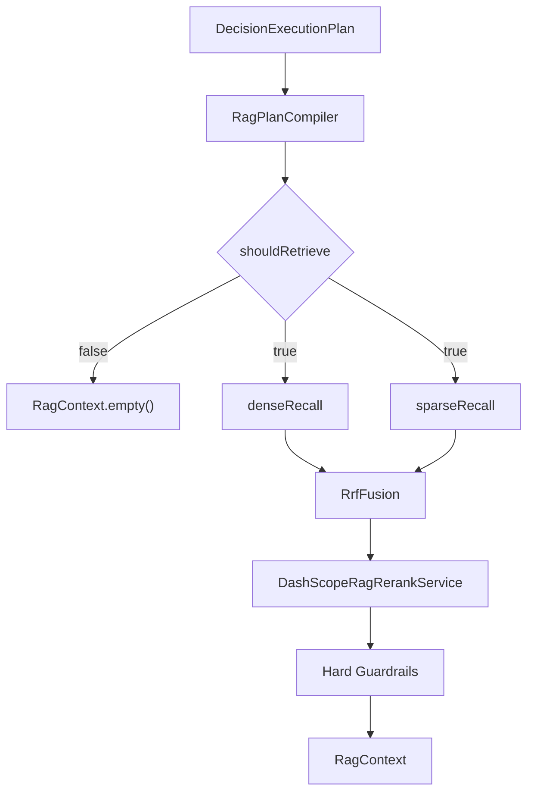

# 面试 RAG 技术实现说明

## 1. 文档范围

本文只描述当前仓库中的主实现，不复述已经删除或停用的旧路径。

当前技术基线是：

- Qdrant 原生 hybrid collection
- dense + sparse/BM25 双路召回
- RRF 融合
- DashScope 文本 rerank
- difficulty window 统一过滤
- `RagContext` 结构化输出

## 2. 核心组件

| 组件 | 作用 | 现行实现 |
|------|------|----------|
| 配置 | 管理 RAG 开关、Qdrant 和 rerank 参数 | `RagProperties` |
| Schema 管理 | 创建 hybrid collection 与 payload index | `QdrantHybridCollectionManager` |
| Point 映射 | 把题卡映射成 dense vector + sparse document + payload | `QdrantHybridPointMapper` |
| 知识入库 | 批量写入 Qdrant | `KnowledgeIngestionService` |
| 请求编译 | 把评估决策编译成检索请求 | `RagPlanCompiler` |
| Hybrid 查询执行 | 执行 dense/sparse 两路 Qdrant 查询 | `QdrantHybridQueryExecutor` |
| 难度窗口解析 | 把 `difficultyHint` 解析成相邻一级窗口 | `DifficultyWindowResolver` |
| 融合 | 合并 dense/sparse 排名 | `RrfFusion` |
| 重排 | 调用 DashScope 文本排序 API | `DashScopeRagRerankService` |
| 检索编排 | 串起召回、融合、重排和护栏 | `RagRetrievalServiceImpl` |
| 结果承载 | 输出结构化上下文与审计 | `RagContext` |

## 3. 数据模型与存储

### 3.1 题卡数据模型

知识单元是 `KnowledgeDocument`。高相关字段包括：

- `id`
- `questionText`
- `intentConcept`
- `referenceContext`
- `scoringKeyPoints`
- `scoringPitfalls`
- `followUpIds`
- `domainCode`
- `questionType`
- `difficulty`
- `keywords`
- `source`
- `version`
- `active`

### 3.2 三种表示

当前会为每张题卡生成三种表示：

| 表示 | 来源字段 | 用途 |
|------|----------|------|
| dense 文本 | `questionText + intentConcept` | 语义召回 |
| sparse 文本 | `questionText + scoringKeyPoints + keywords` | BM25 召回 |
| payload | 结构化业务字段全集 | 命中还原、护栏、rerank 文档构造、上下文注入 |

### 3.3 Qdrant collection 形态

默认配置见 `application.yml`：

- collection 名称：`interview_knowledge_hybrid`
- dense named vector：`dense`
- sparse named vector：`bm25`
- dense 向量维度：`1024`

`QdrantHybridCollectionManager` 当前会确保这两个 payload index：

- `question_type`
- `active`

## 4. 入库流程

`KnowledgeIngestionService.ingest(...)` 的当前流程是：

1. 遍历 `KnowledgeDocument`
2. 生成 dense embedding
3. 通过 `QdrantHybridPointMapper` 构造 `PointStruct`
4. 每批最多 10 条调用 `qdrantClient.upsertAsync(...)`

`QdrantHybridPointMapper` 会把：

- dense 文本写入 named dense vector
- sparse 文本写入 named sparse vector，文档模型为 `qdrant/bm25`
- 结构化字段写入 payload

当前 payload 中仍保留 `domain_code`，但它只是结果元数据，不代表当前检索还依赖它做过滤。

## 5. 检索请求语义

### 5.1 `RagRetrievalRequest` 的字段职责

当前高相关字段职责如下：

| 字段 | 含义 |
|------|------|
| `shouldRetrieve` | 是否应该发起检索 |
| `queryText` | 上游给出的自然语言语义查询 |
| `denseQueryText` | dense 执行文本，当前由编译器直接设为 `queryText` |
| `sparseQueryText` | 由 sparse 术语锚点拼接得到的 BM25 输入 |
| `keywordQueries` | 稀疏词法锚点列表 |
| `questionType` | 业务题型过滤条件 |
| `difficultyHint` | 开启配置时用于 difficulty window 过滤 |
| `focusPoint` | 当前轮考察焦点 |
| `positionCode` | 岗位编码 |
| `experienceLevel` | 候选人资历 |
| `projectName` | 项目题时的项目名 |

### 5.2 `RagPlanCompiler` 编译规则

当前编译规则很明确：

- 无有效 retrieval plan 时，返回 `shouldRetrieve=false`
- `queryText` 直接来自上游 retrieval plan
- `denseQueryText = queryText`
- `keywordHints` 去重后写入 `keywordQueries`
- `sparseQueryText = keywordQueries` 以空格拼接
- `keywordHints` 为空时允许 sparse 分支跳过
- `PROJECT` 会在题型标准化时转成 `PROJECT_DEEP_DIVE`

这说明当前系统已经把“语义查询”和“词法锚点”从编译阶段分开，不再靠运行时把多个来源硬拼成一个查询 brief。

## 6. 执行流程

### 6.1 总流程



### 6.2 dense 分支

`QdrantHybridQueryExecutor.denseRecall(...)` 会：

1. 读取 `denseQueryText`
2. 调用 embedding 模型生成向量
3. 使用 `rag.dense-vector-name`
4. 追加基础 filter
5. 按 `rag.dense-top-k` 与 `rag.min-score` 查询

### 6.3 sparse 分支

`QdrantHybridQueryExecutor.sparseRecall(...)` 会：

1. 读取 `sparseQueryText`
2. 构造 `Points.Document(text, model=qdrant/bm25)`
3. 使用 `rag.sparse-vector-name`
4. 追加同一套基础 filter
5. 按 `rag.sparse-top-k` 查询

如果 `sparseQueryText` 为空，当前实现直接返回空列表，不会发起无意义查询。

### 6.4 基础 filter

当前 dense/sparse 共用 `buildBaseFilter(...)`，包含：

- `active=true`
- 标准化后的 `question_type`
- 可选 difficulty window

现行实现不在这个阶段过滤 `domainCode`。

### 6.5 difficulty window

当 `rag.difficulty-window-enabled=true` 时，`DifficultyWindowResolver` 会把请求中的 `difficultyHint` 解析成有序窗口：

| 输入 | 过滤值 |
|------|--------|
| `L1` | `L1, L2` |
| `L2` | `L1, L2, L3` |
| `L3` | `L2, L3, L4` |
| `L4` | `L3, L4, L5` |
| `L5` | `L4, L5` |

无效值或空值会返回空列表，此时不会追加难度过滤。

### 6.6 融合

`RrfFusion` 接收 dense/sparse 的题卡 ID 排名列表，并返回融合分数。`RagRetrievalServiceImpl` 再基于候选池恢复融合后的题卡顺序。

当前融合候选规模由 `rag.fusion-top-k` 控制，但最终注入上限仍由 `rag.top-k` 决定。

### 6.7 rerank

`DashScopeRagRerankService` 当前调用 DashScope 文本排序接口，输入来自 `RagRerankInputBuilder`：

- query 使用语义查询文本
- document 依次拼接题目、考点、语境、关键点、误区

如果外部 rerank 调用失败，当前实现会退回 fusion 顺序，并继续完成主链路。

### 6.8 硬护栏

`applyHardGuardrails(...)` 的规则是：

- 行为题只保留行为题
- 项目题只保留项目题
- 其他题型要求候选题型一致

当前护栏是最终收口步骤，不参与前置召回。

## 7. 输出结构

### 7.1 `RagContext`

当前输出字段包括：

- `summary`
- `contextText`
- `retrievedMaterials`
- `followUpCandidates`
- `retrievalAudit`
- `hitCount`
- `empty`

### 7.2 `RetrievalAudit`

当前审计字段包括：

- `retrievalTriggered`
- `denseCandidateCount`
- `sparseCandidateCount`
- `difficultyWindowApplied`
- `difficultyWindowValues`
- `fusionTopQuestionIds`
- `rerankPreTopQuestionIds`
- `rerankPostTopQuestionIds`
- `injectedQuestionIds`

异常路径不会再统一抹掉已知阶段状态。只要某一阶段已经成功累积到审计，后续异常时也会尽量保留这些事实。

## 8. 与出题主链路的集成

`QuestionStreamService.buildRetrievalContext(...)` 当前会把下面这些内容注入 `QuestionGenerationInput.RetrievalContext`：

- `summary`
- `retrievalPlans`
- `retrievedMaterials`
- `followUpCandidates`
- `retrievalAudit`

所以当前生成链路消费的是结构化 RAG 上下文，而不是一段不透明的拼接文本。

## 9. 关键配置

`application.yml` 中现行高相关配置如下：

```yaml
rag:
  enabled: ${RAG_ENABLED:false}
  top-k: ${RAG_TOP_K:5}
  min-score: ${RAG_MIN_SCORE:0.65}
  host: ${QDRANT_HOST:localhost}
  port: ${QDRANT_PORT:6334}
  collection-name: ${QDRANT_COLLECTION:interview_knowledge_hybrid}
  initialize-schema: true
  dense-vector-name: ${QDRANT_DENSE_VECTOR_NAME:dense}
  dense-vector-size: ${QDRANT_DENSE_VECTOR_SIZE:1024}
  sparse-vector-name: ${QDRANT_SPARSE_VECTOR_NAME:bm25}
  dense-top-k: ${RAG_DENSE_TOP_K:20}
  sparse-top-k: ${RAG_SPARSE_TOP_K:20}
  fusion-top-k: ${RAG_FUSION_TOP_K:20}
  difficulty-window-enabled: ${RAG_DIFFICULTY_WINDOW_ENABLED:false}
  init-sample-data: ${RAG_INIT_SAMPLE:false}
  rerank:
    api-key: ${AI_BAILIAN_API_KEY:${OPENAI_API_KEY:}}
    endpoint: ${RAG_RERANK_ENDPOINT:https://dashscope.aliyuncs.com/api/v1/services/rerank/text-rerank/text-rerank}
    model: ${RAG_RERANK_MODEL:gte-rerank-v2}
    timeout-ms: ${RAG_RERANK_TIMEOUT_MS:5000}
    top-n: ${RAG_RERANK_TOP_N:10}
```

## 10. 现行实现边界

需要明确三件事：

1. 当前文档说的是现行主路径，不包含历史实验代码或旧设计稿。
2. `domainCode` 仍是题卡与结果元数据，但不是当前召回过滤条件。
3. rerank、dense、sparse 的职责已经拆开，后续演进应继续沿着单一职责推进，而不是重新把多个视图揉回一个查询字符串。

## 11. 总结

当前面试 RAG 的技术实现已经具备完整闭环：

- 入库走原生 Qdrant hybrid point
- 检索走 dense/sparse 双路召回
- 排序走 RRF + DashScope rerank
- 业务收口靠题型硬护栏
- 输出通过 `RagContext` 结构化注入出题主链路

因此，后续讨论若再引用旧的前置裁剪、旧的单路 dense 检索或旧的 query brief 拼接方式，都不应再被视为当前实现描述。
