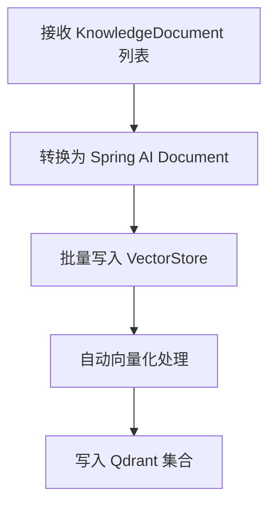
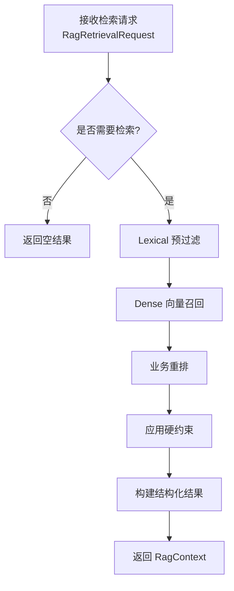
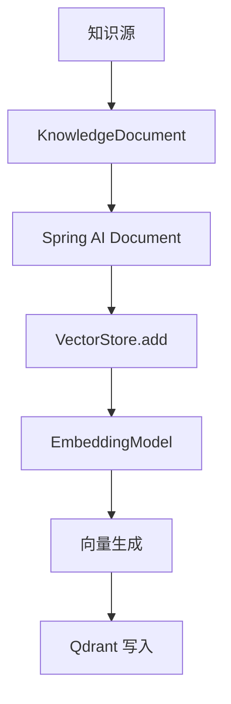
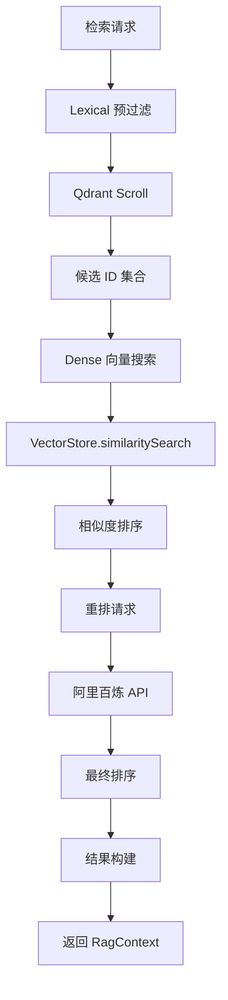

# RAG 链路技术实现分析

## 1. 整体架构

### 1.1 核心组件

| 组件 | 职责 | 实现类 | 位置 |
|------|------|--------|------|
| 配置管理 | RAG 相关配置 | `RagProperties` | rag/config/ |
| 基础设施 | Qdrant 客户端和 VectorStore | `RagConfiguration` | rag/config/ |
| 知识入库 | 批量写入知识文档 | `KnowledgeIngestionService` | rag/service/ |
| 检索服务 | 核心检索逻辑 | `RagRetrievalServiceImpl` | rag/service/impl/ |
| 重排服务 | 文本排序 | `DashScopeRagRerankService` | rag/service/impl/ |
| 数据传输 | 检索请求和结果 | `RagRetrievalRequest`, `RagContext` | rag/dto/ |

### 1.2 技术栈

- **向量数据库**: Qdrant (gRPC 接口)
- **向量化模型**: OpenAI Embedding (通过 Spring AI)
- **重排服务**: 阿里百炼 Text Rerank API
- **框架**: Spring Boot 3, Spring AI 1.0.0

## 2. 知识入库流程

### 2.1 数据模型

**`KnowledgeDocument`** 字段：
- `id`: 题目唯一标识
- `questionText`: 题目文本
- `intentConcept`: 考点概念
- `referenceContext`: 参考语境
- `scoringKeyPoints`: 评分关键点
- `scoringPitfalls`: 评分误区
- `domainCode`: 知识域编码
- `questionType`: 题目类型
- `difficulty`: 难度等级
- `keywords`: 关键词列表
- `followUpIds`: 跟进题目ID列表
- `active`: 是否激活
- `version`: 版本号
- `source`: 来源

### 2.2 入库流程



**关键步骤**：
1. **构建 metadata**: 将 `KnowledgeDocument` 字段映射为 Qdrant metadata
2. **生成稳定 ID**: 使用 UUID 基于题目 ID 生成
3. **批量处理**: 每批最多 10 个文档，避免 API 限制
4. **自动向量化**: Spring AI VectorStore 内部调用 EmbeddingModel

## 3. 检索核心流程

### 3.1 检索链路



### 3.2 详细步骤

#### 1. Lexical 预过滤
- **目的**: 快速收缩候选集，提高检索效率
- **实现**: 使用 Qdrant 的 `scroll` API 结合全文索引
- **过滤条件**:
  - 激活状态 (`active=true`)
  - 题目类型匹配
  - 知识域匹配
  - 关键词匹配（`question_text`、`intent_concept`、`keywords`）
- **返回**: 候选题目 ID 集合

#### 2. Dense 向量召回
- **目的**: 基于语义相似度召回相关文档
- **实现**: 使用 Spring AI VectorStore 的 `similaritySearch`
- **参数**:
  - 检索文本: 焦点 + 关键词 + 必须包含线索
  - TopK: 可配置（默认 5）
  - 相似度阈值: 可配置（默认 0.65）
- **过滤**: 只保留 lexical 预过滤中的题目

#### 3. 业务重排
- **目的**: 优化排序结果，提升相关性
- **实现**: 调用阿里百炼 Text Rerank API
- **输入**:
  - 查询摘要: 包含题型、目标、焦点等
  - 文档文本: 包含题目、考点、语境等
- **回退**: API 失败时回退到基于 dense 排名的本地排序

#### 4. 应用硬约束
- **目的**: 确保结果符合业务规则
- **约束**:
  - 行为题 (`BEHAVIORAL`) 只能匹配行为题
  - 项目题 (`PROJECT`) 只能匹配项目题
  - 知识域必须匹配（如果指定）

#### 5. 构建结果
- **总结**: 生成检索结果摘要
- **上下文**: 构建格式化的上下文文本
- **跟进候选**: 收集跟进题目 ID
- **审计信息**: 记录检索各阶段的统计信息

## 4. 技术实现细节

### 4.1 Qdrant 配置与优化

**索引优化**:
- **向量索引**: 自动创建（基于 Embedding 维度）
- **Lexical 索引**:
  - `question_text`: 文本索引，多语言分词器
  - `intent_concept`: 文本索引，多语言分词器
  - `keywords`: 关键词索引

**连接配置**:
- gRPC 连接，默认端口 6334
- 集合名: 可配置（默认 `interview_knowledge`）
- 自动初始化 schema: 可配置

### 4.2 检索参数配置

| 参数 | 说明 | 默认值 | 配置位置 |
|------|------|--------|----------|
| `topK` | 检索结果数量 | 5 | application.yml: rag.top-k |
| `minScore` | 相似度阈值 | 0.65 | application.yml: rag.min-score |
| `rerank.topN` | 重排结果数量 | 10 | application.yml: rag.rerank.top-n |
| `rerank.timeoutMs` | 重排超时时间 | 5000 | application.yml: rag.rerank.timeout-ms |
| `LEXICAL_PREFILTER_MULTIPLIER` | 预过滤倍数 | 4 | 代码常量 |

### 4.3 性能优化

1. **批量处理**: 知识入库采用批量模式，减少网络往返
2. **预过滤**: Lexical 预过滤减少向量搜索范围
3. **并行处理**: HTTP 客户端使用异步连接
4. **缓存**: 合理设置 Qdrant 缓存参数
5. **错误处理**: 重排失败时回退到本地排序，保证系统稳定性

### 4.4 容错机制

- **服务降级**: RAG 服务不可用时，返回空结果
- **API 失败回退**: 重排 API 失败时使用本地排序
- **异常捕获**: 统一捕获并记录检索过程中的异常
- **空值处理**: 对各种输入进行空值检查

## 5. 调用流程

### 5.1 知识入库调用

```java
// 示例代码
KnowledgeIngestionService ingestionService = ...;
List<KnowledgeDocument> documents = ...;
int count = ingestionService.ingest(documents);
```

### 5.2 检索调用

```java
// 示例代码
RagRetrievalService retrievalService = ...;
RagRetrievalRequest request = RagRetrievalRequest.builder()
    .questionType("PRINCIPLE")
    .domainCode("JAVA_BASE")
    .focusPoint("线程池核心参数")
    .keywordQueries(List.of("线程池", "核心线程数", "最大线程数"))
    .build();
RagContext context = retrievalService.retrieve(request);
```

### 5.3 典型应用场景

1. **题目生成**: 为面试生成相关题目
2. **答案评估**: 为候选人答案提供评估参考
3. **学习推荐**: 基于面试表现推荐学习内容
4. **AI 咨询**: 为用户提供题目相关的智能咨询

## 6. 数据流

### 6.1 知识入库数据流



### 6.2 检索数据流



## 7. 监控与审计

### 7.1 审计信息

`RagContext.RetrievalAudit` 包含以下信息：
- `retrievalTriggered`: 是否触发检索
- `lexicalCandidateCount`: Lexical 预过滤候选数
- `denseCandidateCount`: Dense 召回候选数
- `rerankPreTopQuestionIds`: 重排前 Top 题目 ID
- `rerankPostTopQuestionIds`: 重排后 Top 题目 ID
- `injectedQuestionIds`: 最终注入的题目 ID

### 7.2 日志记录

关键步骤都有详细的日志记录：
- 初始化 Qdrant 客户端和索引
- 知识入库开始和完成
- 检索开始和结果
- API 调用和错误

## 8. 配置与部署

### 8.1 核心配置项

```yaml
# RAG 配置
rag:
  enabled: true  # 是否启用 RAG
  top-k: 5       # 检索结果数量
  min-score: 0.65  # 相似度阈值
  host: localhost  # Qdrant 主机
  port: 6334       # Qdrant gRPC 端口
  collection-name: interview_knowledge  # 集合名
  initialize-schema: true  # 自动初始化 schema
  init-sample-data: false  # 是否初始化样本数据
  rerank:
    api-key: ${AI_BAILIAN_API_KEY}  # 重排 API Key
    endpoint: https://dashscope.aliyuncs.com/api/v1/services/rerank/text-rerank/text-rerank
    model: gte-rerank-v2  # 重排模型
    timeout-ms: 5000  # 超时时间
    top-n: 10  # 重排结果数量
```

### 8.2 部署要求

- **Qdrant 服务**: 运行在指定主机和端口
- **网络连接**: 能访问阿里百炼 API（重排服务）
- **API Key**: 配置有效的 `AI_BAILIAN_API_KEY`
- **资源要求**: Qdrant 需要足够的内存存储向量

## 9. 代码优化建议

### 9.1 性能优化

1. **批量大小调优**: 根据 Qdrant 性能调整批量处理大小
2. **缓存策略**: 考虑添加本地缓存，减少重复检索
3. **索引优化**: 根据实际数据分布优化 Qdrant 索引参数
4. **并发处理**: 考虑使用并行流处理多个检索请求

### 9.2 功能增强

1. **多模态支持**: 考虑支持图片等多模态知识
2. **个性化检索**: 根据用户历史行为调整检索策略
3. **自动评估**: 定期评估检索质量并调整参数
4. **知识更新**: 实现增量更新机制

### 9.3 代码质量

1. **异常处理**: 增强异常处理和错误恢复机制
2. **参数验证**: 加强输入参数验证
3. **文档完善**: 完善代码注释和文档
4. **单元测试**: 增加单元测试覆盖率

## 10. 总结

### 10.1 技术特点

1. **模块化设计**: 清晰的组件划分和职责分离
2. **可配置性**: 丰富的配置选项，适应不同场景
3. **性能优化**: 多阶段检索策略，平衡速度和精度
4. **容错机制**: 完善的错误处理和回退策略
5. **可扩展性**: 易于集成新的检索和重排算法

### 10.2 应用价值

- **提升面试质量**: 提供更精准的题目和评估参考
- **个性化学习**: 基于用户表现推荐学习内容
- **智能咨询**: 为用户提供专业的题目相关咨询
- **数据驱动**: 基于真实数据持续优化面试体验

---

*文档版本: v1.0 | 更新日期: 2026-03-31*
