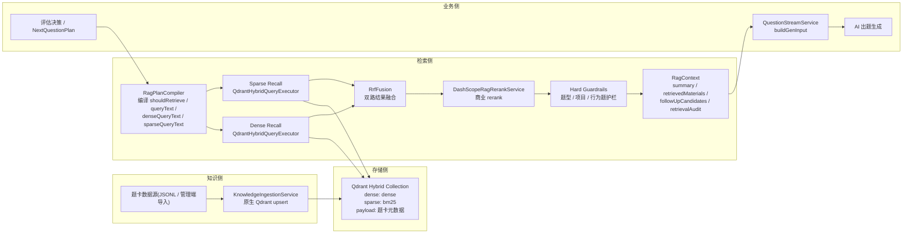
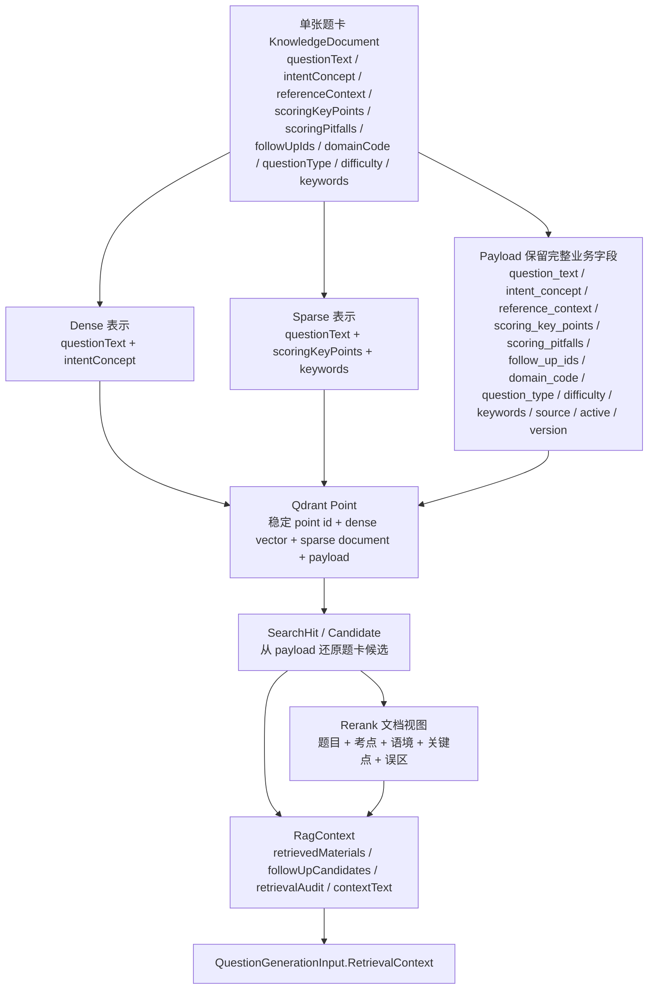
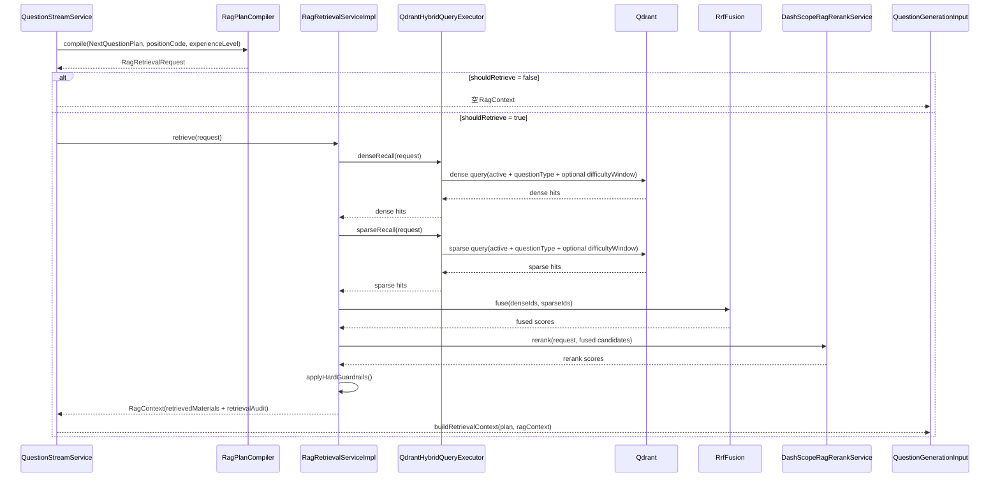

# 面试 RAG 现有实现架构评审报告

## 1. 报告目的

本文重点回答 4 个问题：

1. 为什么面试出题需要 RAG，而不能只依赖大模型自由生成。
2. 当前系统如何把题卡知识库、检索、重排和出题主链路连接成一条完整流程。
3. 这套方案的关键技术点和工程控制点分别是什么。
4. 当前实现的完成度、可运维性和后续演进边界是什么。

本文配套 3 张可保存的 Mermaid 图源文件，位于：

- [architecture-overview.mmd](D:/a05-cursor/docs/superpowers/reports/assets/2026-04-07-interview-rag-current-implementation/architecture-overview.mmd)
- [retrieval-sequence.mmd](D:/a05-cursor/docs/superpowers/reports/assets/2026-04-07-interview-rag-current-implementation/retrieval-sequence.mmd)
- [knowledge-dataflow.mmd](D:/a05-cursor/docs/superpowers/reports/assets/2026-04-07-interview-rag-current-implementation/knowledge-dataflow.mmd)

## 2. 项目背景与问题定义

面试出题场景与通用问答不同。系统需要根据岗位、候选人回答、题型切换和项目上下文，持续生成“下一道题”。如果完全依赖大模型自由生成，容易出现 3 类问题：

- 题目漂移：问题看起来合理，但与当前岗位能力模型、题型目标或项目主线脱节。
- 知识点不稳定：同一轮面试中，出题深度、术语精度和考点覆盖缺乏稳定约束。
- 行为题与项目题失焦：行为题容易混入技术细节，项目题容易退化为脱离项目锚点的泛技术题。

因此，当前系统不是把 RAG 当成“问答机器人”，而是把它作为**面试出题链路中的受控知识注入层**。其核心目标不是直接回答问题，而是为下一题生成提供更稳定的知识支撑、术语锚点和可审计上下文。

## 3. 方案总览

当前现行方案可以概括为：

**题卡知识库 + hybrid 检索 + 结果重排 + 题型护栏 + RAG 上下文注入出题主链路。**

这不是单路检索，也不是“检到什么就直接喂给模型”。系统将一次检索分为 5 个主要阶段：

1. 根据评估决策生成可执行的检索请求。
2. 对同一请求执行 dense 与 sparse/BM25 双路独立召回。
3. 使用 RRF 做第一轮融合排序。
4. 使用商业 rerank 做最终主排序。
5. 使用程序硬护栏过滤题型明显不匹配的候选。

整体架构如下：

这一架构的关键价值在于：RAG 不是替代出题模型，而是把“知识召回、排序、护栏、可观测性”独立出来，形成一个可控、可审计、可降级的中间层。

## 4. 知识库数据模型与入库设计

### 4.1 题卡作为基础知识单元

当前知识库的基础单元不是长文档切片，而是**结构化面试题卡**。每张题卡包含：

- `questionText`：题目本身
- `intentConcept`：核心考察点
- `referenceContext`：业务语境与正确处理背景
- `scoringKeyPoints`：关键得分点
- `scoringPitfalls`：典型误区
- `followUpIds`：追问候选
- `domainCode`、`questionType`、`difficulty`
- `keywords`
- `source`、`version`、`active`

这种建模方式的优点是：知识单元天然与出题目标一致。系统检索到的不是抽象文本段，而是可直接被注入下一题生成链路的结构化题卡。

### 4.2 一张题卡，三种表示

当前实现不会把题卡简单拼成一个统一检索文本，而是拆成 3 个层次：

1. **Dense 表示**
   当前只使用：
   - `questionText`
   - `intentConcept`

2. **Sparse 表示**
   当前只使用：
   - `questionText`
   - `scoringKeyPoints`
   - `keywords`

3. **Payload 表示**
   保留完整业务字段，用于命中还原、rerank 文档构造、题型护栏判断和下游上下文注入。

这样做的原因是：

- dense 分支负责语义召回，优先保留“题目 + 考点”这类高语义密度内容。
- sparse/BM25 分支负责术语锚点命中，优先保留“题目 + 得分点 + 关键词”。
- `referenceContext` 和 `scoringPitfalls` 不再进入主检索表示，而是留给 rerank 和最终注入，避免把长叙事噪音直接送入召回阶段。

对应的数据流如下：

### 4.3 原生 Qdrant Hybrid 入库

当前入库链路已经从旧的通用存储抽象切换为 **Qdrant 原生 Java Client**。入库过程包括：

1. 对题卡的 dense 表示调用 embedding 模型。
2. 生成 named dense vector。
3. 生成 named sparse document，模型标记为 `qdrant/bm25`。
4. 组装 payload 元数据。
5. 通过原生 `upsertAsync` 写入 hybrid collection。

当前 collection schema 采用：

- collection 名称：`interview_knowledge_hybrid`
- dense named vector：`dense`
- sparse named vector：`bm25`
- payload index：`question_type`、`active`

其中 `domain_code` payload 仍保留在 schema 与 payload 中，用于数据完整性、下游消费和结果展示；但它不再承担召回、rerank 或后置护栏语义。

## 5. 检索执行链路设计

### 5.1 从评估决策到可执行检索请求

面试系统不会无条件触发检索。当前 `RagPlanCompiler` 会先把评估决策层给出的 `retrievalPlans` 编译成 `RagRetrievalRequest`，再由检索层执行。

当前编译输出的核心字段包括：

- `shouldRetrieve`
- `questionType`
- `queryText`
- `denseQueryText`
- `sparseQueryText`
- `keywordQueries`
- `focusPoint`
- `difficultyHint`
- `positionCode`
- `experienceLevel`
- `projectName`

当前编译规则是：

- `queryText` 由上游 retrieval plan 提供，要求是独立、完整的自然语言语义查询
- `denseQueryText = queryText`
- `keywordHints` 会先去重，再写入 `keywordQueries`
- `sparseQueryText = keywordQueries join`
- `keywordHints` 为空时，允许 sparse 分支为空，但 dense 分支仍可执行
- `shouldRetrieve=false` 时，整个检索层直接短路

如果按源码把 `retrievalPlans -> RagRetrievalRequest` 的映射逐字段展开，当前规则其实更具体：

| 目标字段 | 来源 | 当前映射规则 |
|------|------|------|
| `questionType` | `DecisionExecutionPlan.targetQuestionType` | 先做标准化；如果上游给的是 `PROJECT`，会被改写为 `PROJECT_DEEP_DIVE` |
| `retrievalPlan` | `DecisionExecutionPlan.retrievalPlans` | 只取第一个元素；后续元素当前不会参与编译 |
| `shouldRetrieve` | 标准化后的 `questionType` + 第一个 `retrievalPlan` | 仅当题型属于 `PRINCIPLE / SCENARIO / BEHAVIORAL / PROJECT_DEEP_DIVE` 且第一个 `retrievalPlan` 存在时才为 `true` |
| `queryText` | 第一个 `retrievalPlan.queryText` | `trim` 后直接写入 |
| `denseQueryText` | `queryText` | 与 `queryText` 保持同值 |
| `keywordQueries` | 第一个 `retrievalPlan.keywordHints` | 去掉空值、去重、保序 |
| `sparseQueryText` | `keywordQueries` | 使用空格拼接；如果 `keywordQueries` 为空，则为空字符串 |
| `difficultyHint` | 第一个 `retrievalPlan.difficultyHint` | `trim` 后直接写入 |
| `focusPoint` | `DecisionExecutionPlan.nextFocus` | `trim` 后透传 |
| `positionCode` | `compile(...)` 入参 | `trim` 后透传 |
| `experienceLevel` | `compile(...)` 入参 | `trim` 后透传 |
| `projectName` | `DecisionExecutionPlan.nextItemName` | 仅当标准化后的题型为 `PROJECT_DEEP_DIVE` 时透传，否则置空 |

当 `shouldRetrieve=false` 时，当前实现会返回一个“空请求”：

- `queryText / denseQueryText / sparseQueryText / difficultyHint` 置空
- `keywordQueries` 置空列表
- `questionType / focusPoint / positionCode / experienceLevel / projectName` 仍按当前轮上下文写入

### 5.2 双路独立召回，而不是单路裁剪

当前检索执行采用两条独立分支：

- **Dense Recall**
  将 `denseQueryText` 做 embedding 后，搜索 named dense vector。

- **Sparse/BM25 Recall**
  将 `sparseQueryText` 作为 BM25 文本查询，搜索 named sparse vector。

当前召回阶段使用同一套基础过滤条件：

- `active=true`
- `questionType`
- 开关开启时的 difficulty window

其中 `difficultyHint` 会在 `rag.difficulty-window-enabled=true` 且值有效时被解析为相邻一级窗口，并同时加到 dense / sparse 两路查询的 filter 中。`domainCode` 当前不参与召回阶段 filter，也不参与后置护栏或 rerank。它仅作为题卡与结果的展示元数据保留。

### 5.3 单次请求执行时序

这条链路的关键点在于：dense 与 sparse 不是主辅关系，而是两条平行证据源。真正的排序结果由后续融合、重排和护栏共同决定。

## 6. 融合、重排与护栏机制

### 6.1 RRF：让双路证据进入统一排序空间

当前系统使用纯 Java 实现的 **Reciprocal Rank Fusion（RRF）** 对 dense 与 sparse 两路结果进行融合。其目的不是取代 rerank，而是先完成一轮轻量、稳定、可审计的双路合并。

这一步的价值在于：

- 同时被 dense 和 sparse 命中的题卡，会获得更稳定的前排位置。
- dense 强但 sparse 弱，或 sparse 强但 dense 弱的题卡，也仍有机会进入候选池。
- 融合逻辑不依赖外部服务，具备确定性和可测性。

### 6.2 商业 rerank：把最终排序交给更强的语义排序器

在 RRF 之后，系统会调用 DashScope 商业 rerank 服务做最终排序。当前 rerank query 已经收缩为语义查询文本，不再继续拼入题型、术语查询、关键词、目标难度这类标签化元信息。

进入 rerank 的候选文档会带上：

- 题目
- 考点
- 语境
- 关键点
- 误区

也就是说，当前 rerank 不只是对“标题”做排序，而是对题卡的核心语义结构进行再判断；如果商业 rerank 调用失败，系统会回退到 fusion 排序，而不是中断主链路。

### 6.3 程序硬护栏：保证结果不发生明显题型漂移

如果说 RRF 与 rerank 负责“找得准”，那么硬护栏负责“不能错得离谱”。

当前主要护栏规则包括：

- **行为题护栏**
  最终候选必须是 `BEHAVIORAL`，防止行为题被技术题污染。

- **项目题护栏**
  最终候选必须是 `PROJECT`。

- **其他题型护栏**
  候选题型必须与目标题型一致。

这意味着当前系统采取的是：

**召回阶段在 `active/questionType/difficulty window` 范围内保守放宽，最终注入阶段再严格收口。**

这是一个典型的“高召回 + 题型收口”工程策略，适合面试出题这种不能明显跑偏的业务。

## 7. 与出题主链路的集成方式

当前 RAG 不是孤立服务，而是嵌入在 `QuestionStreamService` 的主流程中。典型过程是：

1. 评估上一题回答，得到 `NextQuestionPlan`
2. 安全调用 RAG 检索
3. 将结果构造成 `QuestionGenerationInput`
4. 交给 AI 出题生成

当前实现有两个重要工程点：

- **RAG 失败不阻断主链路**
  如果 `rag.enabled=false`、检索异常、无命中或任一阶段出错，系统都会回退到空 `RagContext`，题目生成流程继续执行。

- **RAG 结果是结构化输入，而不是拼接字符串黑箱**
  `QuestionGenerationInput.RetrievalContext` 当前会同时携带：
  - retrievalPlans
  - retrievedMaterials
  - followUpCandidates
  - retrievalAudit
  - summary

这使得生成链路既能消费知识内容，也能消费检索审计信息和追问候选。

当前 `RagContext` 输出的关键结果包括：

- `summary`
- `contextText`
- `retrievedMaterials`
- `followUpCandidates`
- `retrievalAudit`

其中 `retrievalAudit` 已具备完整的链路可观测字段：

- `retrievalTriggered`
- `denseCandidateCount`
- `sparseCandidateCount`
- `difficultyWindowApplied`
- `difficultyWindowValues`
- `fusionTopQuestionIds`
- `rerankPreTopQuestionIds`
- `rerankPostTopQuestionIds`
- `injectedQuestionIds`

当前异常路径也会复用已经累计到的审计状态，而不是统一抹成全空骨架。这使得 RAG 不再是“黑盒检索”，而是一个可以回放、观察和调试的中间层。

## 8. 工程实现亮点与可运维性

从评审视角看，当前实现不仅有算法链路，还有较完整的工程控制面。

### 8.1 启停与兼容

- `rag.enabled=false` 时，系统自动切换到 `NoopRagRetrievalService`
- 出题主链路保持向后兼容，不会因为未启用 Qdrant 而崩溃

### 8.2 Schema 自动初始化

- 应用启动时可根据配置自动初始化 hybrid collection
- 可通过 `initializeSchema` 控制是否由应用负责建库

### 8.3 配置化检索能力

当前可配置项包括：

- `collectionName`
- `denseVectorName`
- `denseVectorSize`
- `sparseVectorName`
- `denseTopK`
- `sparseTopK`
- `fusionTopK`
- `topK`
- `minScore`
- `difficultyWindowEnabled`
- rerank endpoint / model / timeout / topN

这意味着当前方案不是写死在代码里的实验，而是具备一定运维调优能力的工程实现。

### 8.4 管理端导入能力

当前已经提供内部管理端接口：

- `POST /api/v1/admin/knowledge/ingest`
- `POST /api/v1/admin/knowledge/import-jsonl`

这让知识库更新不依赖手工改代码，而可以通过结构化导入流程完成。

### 8.5 Cutover Runbook

当前还提供了独立 runbook，用于指导：

- 新 collection 创建
- schema 验证
- 数据重建
- 切换默认 collection
- 删除旧 collection 前确认

这说明方案已经考虑了从“功能开发”走向“真实切换”的运维路径。

## 9. 测试与验证

当前实现没有把主观质量判断混入正确性测试，而是采用**确定性契约测试 + 链路回归测试**的组合。

核心覆盖点包括：

- 配置与 schema 初始化
- dense/sparse 文本构造
- 原生 Qdrant 入库映射
- JSONL 导入校验
- 检索请求编译
- RRF 融合逻辑
- 检索服务 orchestrator
- 审计字段输出
- RAG 结果注入出题输入
- 回答提交到下一题生成的决策主链路

这种测试策略的价值是：

- 正确性判断基于明确契约，而不是作者主观阈值
- 可以稳定保护当前实现边界
- 不会因为外部 embedding 波动或小样本噪音，把工程回归测试做成随机红灯

换句话说，当前实现已经具备**可维护的工程回归保护**，而不是只靠人工点点看结果。

## 10. 当前边界与后续演进

当前实现已经形成完整链路，但并不假装“已经最终最优”。从工程诚实性出发，当前边界包括：

1. **字段拆分仍是当前合理默认，不是最终最优解**
   当前 dense/sparse 字段职责已经收紧，但是否最优，仍可通过后续消融评估继续验证。

2. **`domainCode` 当前是纯元数据**
   当前仅在 payload、返回结果、审计和展示中保留 `domainCode`，不参与召回 filter、rerank 或硬护栏。

3. **主观质量评估体系尚未单独建设**
   当前已删除历史上混杂主观阈值的评测夹具，后续如果要做更专业的 RAG 评估，应独立建设数据集和指标体系，而不是混入代码正确性测试。

4. **最终生产 cutover 仍需人工执行**
   现有 runbook 已具备，但旧 collection 删除等动作必须人工确认后执行。

这些边界不是缺陷掩饰，而是当前系统对“已完成实现”和“后续演进空间”的清晰划分。

## 11. 结论

当前面试 RAG 实现已经不再是一个简单的“向量检索插件”，而是一条完整落地的出题知识支撑链路。它具备以下几个核心特征：

- **链路完整**：从题卡入库、检索请求编译、双路召回、融合、重排、护栏到出题输入注入，形成了闭环。
- **工程可控**：具备配置开关、自动 schema、导入接口、runbook 和回退路径。
- **业务约束明确**：通过题型护栏把 RAG 从“能检索”提升到“适合面试出题”。
- **结果可审计**：通过 `retrievalAudit` 记录每个阶段的候选规模与 top ids，使检索结果具备可观察性和可回放性。

从技术评审角度看，这套实现的价值不只是“用了 hybrid 检索”，而是把 hybrid retrieval、rerank、业务护栏和主链路集成做成了一个**可运行、可维护、可扩展的面试出题基础设施**。
