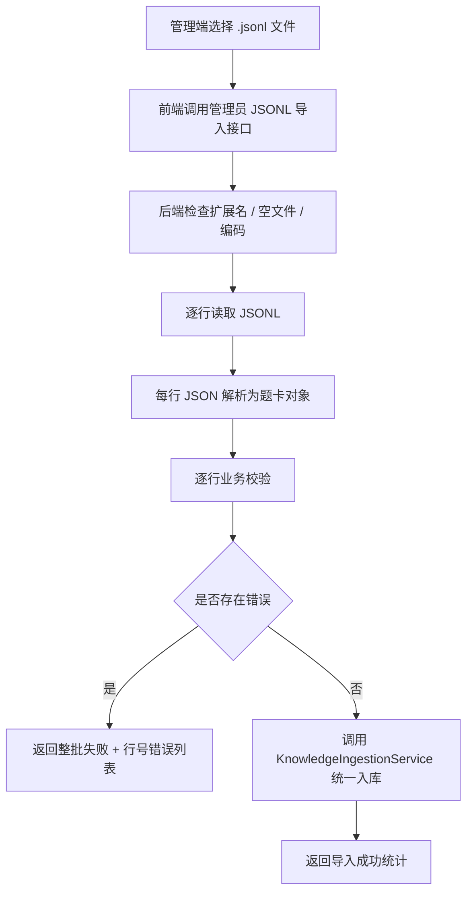

# 管理端 RAG JSONL 导入设计

## 背景

当前项目已经具备以下基础：

- 管理端已有 `RAG语料管理` 页面入口：
  - [AdminLayout.vue](/D:/a05-cursor/frontend/src/components/AdminLayout.vue)
  - [RagManagement.vue](/D:/a05-cursor/frontend/src/components/RagManagement.vue)
- 后端已有管理员知识入库接口：
  - [KnowledgeAdminController.java](/D:/a05-cursor/backend/src/main/java/com/a05/aiinterview/rag/controller/KnowledgeAdminController.java)
- 后端已有统一题卡入库模型：
  - [KnowledgeDocument.java](/D:/a05-cursor/backend/src/main/java/com/a05/aiinterview/rag/dto/KnowledgeDocument.java)
  - [KnowledgeIngestionService.java](/D:/a05-cursor/backend/src/main/java/com/a05/aiinterview/rag/service/KnowledgeIngestionService.java)

但当前管理端页面仍然是演示性质的“文件上传 / 解析 / 向量化 / 命中率分析”大看板，和实际后端能力并不匹配。现阶段最实际的后台需求不是做一整套文档解析平台，而是先让管理员可以把结构化题卡语料以 JSONL 形式导入到 RAG 知识库。

## 目标

在现有管理端 `RAG语料管理` 页面基础上，实现一个**最小可用、真实可用**的 JSONL 导入能力，满足以下目标：

- 复用现有管理端页面，不新建独立后台
- 首期只支持 `.jsonl`
- 上传后自动处理，不增加“先预览再确认”的二次操作
- 后端在真正入库前必须完成全量解析与校验
- 任意一行不合法时整批失败，不允许部分成功
- 错误信息由程序规则生成，精确到行号，不使用大模型

## 非目标

本设计明确不包含以下内容：

- PDF / DOCX / TXT / Markdown 导入
- 通用文档解析、切片策略配置、OCR 等能力
- 上传后预览再确认的双阶段导入流程
- 基于大模型的“自动修复 JSONL”建议
- 历史批次管理、批量回滚、版本化导入台账
- 管理端完整语料运营平台

## 关键纠偏

### 1. 首期不做“万能文件上传”

现有 [RagManagement.vue](/D:/a05-cursor/frontend/src/components/RagManagement.vue) 页面展示了 PDF、DOCX、TXT、MD 等多种格式，但这只是视觉占位，不代表现在应该同时打通这些格式。

首期必须收口成：

- 只支持 `.jsonl`

否则会把“结构化题卡导入”问题，错误地扩展成“通用知识文档平台”问题。

### 2. 首期不做前端 JSONL 解析

虽然前端也能逐行解析 JSONL，但首期更合理的职责边界是：

- 前端负责选文件、发请求、显示结果
- 后端负责文件格式校验、逐行解析、业务规则校验、入库

原因：

- 错误口径应统一在后端
- 同一套规则也更容易写测试
- 避免以后前后端各自维护一套 JSONL 校验逻辑

### 3. “上传后立即导入”不等于“边解析边入库”

首期虽然选择“上传后立即导入”，但后端内部仍应遵守：

1. 先全量读取并解析全部行
2. 全量校验通过后再统一入库
3. 任意一行失败则整批拒绝

否则会出现“前几条已进库、后几条失败”的半成功状态。

## 方案比较

### 方案 A：前端解析 JSONL，复用现有 JSON 入库接口

做法：

- 前端读取 `.jsonl`
- 前端逐行解析成 `documents[]`
- 调用现有 `/admin/knowledge/ingest`

优点：

- 后端改动小
- 可以直接复用现有入库接口

缺点：

- 前后端会分担校验逻辑，边界不清
- 错误信息可能会散落在前端
- 后续 CLI / 脚本 / 管理端如果都要导入 JSONL，会缺统一后端能力

### 方案 B：后端新增专用 JSONL 上传接口

做法：

- 管理端上传 `.jsonl` 文件
- 后端统一做文件类型检查、逐行解析、规则校验
- 全部通过后调用 `KnowledgeIngestionService`

优点：

- 职责清晰
- 错误口径统一
- 最适合作为后续后台、脚本、批量导入的统一入口

缺点：

- 比方案 A 多一个专用接口
- 需要处理 `multipart/form-data`

### 方案 C：上传后先预检预览，再确认导入

做法：

- 上传文件
- 后端先解析并返回预览和错误
- 用户确认后再导入

优点：

- 用户体验最稳
- 更像正式运营后台

缺点：

- 状态复杂度明显上升
- 首期实现过重

### 推荐方案

推荐采用 **方案 B**。

原因：

- 它比前端解析更稳
- 又比“双阶段预检”更轻
- 很符合“最快能用，但别做脏”的目标

## 最终设计

### 整体流程



## 后端设计

### 新增接口

新增管理员接口：

- `POST /api/v1/admin/knowledge/import-jsonl`

请求类型：

- `multipart/form-data`

字段：

- `file`: `.jsonl` 文件

权限要求：

- 继续沿用 `/admin/**` 管理员鉴权

### 接口职责

该接口不直接复用现有 `/admin/knowledge/ingest` 的 JSON body 结构，而是单独承担以下职责：

1. 文件扩展名校验
2. 文件内容读取
3. JSONL 逐行解析
4. 结构化字段校验
5. 通过后调用现有 `KnowledgeIngestionService`

### 行级校验规则

每一行解析后，至少校验以下规则：

- `id` 非空
- `questionText` 非空
- `intentConcept` 非空
- `referenceContext` 可为空但建议保留
- `scoringKeyPoints` 必须是数组
- `scoringPitfalls` 必须是数组
- `followUpIds` 必须是数组
- `questionType` 必须在允许集合中
- `difficulty` 必须为 `L1-L5`
- `domainCode` 必须符合现有统一口径
- 当 `questionType = BEHAVIORAL` 时，`domainCode` 必须为空字符串或缺省

### 失败策略

采用**整批失败**策略。

定义：

- 只要任意一行解析或校验失败
- 本次文件不调用入库
- 返回完整错误列表

不允许：

- 只导入合法行
- 自动跳过错误行
- 先入一部分再失败

### 错误信息生成方式

错误信息必须由后端程序规则生成，不得使用大模型。

每条错误建议包含：

- `lineNo`
- `field`
- `reason`
- `expected`

示例：

```json
{
  "code": 400,
  "message": "JSONL校验失败",
  "data": {
    "fileName": "rag.jsonl",
    "totalLines": 20,
    "validLines": 17,
    "errors": [
      {
        "lineNo": 18,
        "field": "difficulty",
        "reason": "字段值非法",
        "expected": "L1-L5"
      }
    ]
  }
}
```

### 成功返回

```json
{
  "code": 0,
  "message": "导入成功",
  "data": {
    "fileName": "rag.jsonl",
    "totalLines": 20,
    "validLines": 20,
    "ingestedCount": 20
  }
}
```

## 前端设计

### 页面复用原则

继续复用 [RagManagement.vue](/D:/a05-cursor/frontend/src/components/RagManagement.vue) 作为承载页，但要删掉首期无效幻想，收口成“JSONL 题卡导入页”。

### 页面改动范围

#### 上传区

- 保留现有拖拽上传视觉区
- 文案改为：
  - “拖拽 JSONL 文件到此处或点击上传”
  - “仅支持 JSONL 题卡导入格式”
- `accept` 改成：
  - `.jsonl`
- 格式徽标改成只展示 JSONL

#### 上传队列

继续保留队列，但状态缩成：

- `uploading`
- `success`
- `failed`

每条文件显示：

- 文件名
- 文件大小
- 进度
- 状态
- 失败时的摘要错误

#### 结果反馈

成功时显示：

- 总行数
- 成功导入条数

失败时显示：

- 总行数
- 合法行数
- 前若干条错误摘要
- 可展开查看完整错误列表

### 前端职责边界

前端只负责：

- 选择文件
- 触发上传
- 展示成功或失败

前端不负责：

- 解析 JSONL
- 业务规则校验
- 组装 `documents[]`

## 数据格式要求

每一行必须是一个独立 JSON 对象，而不是一个大数组。

示例：

```jsonl
{"id":"redis-001","questionText":"讲一下 Redis 缓存穿透","intentConcept":"考察缓存空对象和布隆过滤器","referenceContext":"...","scoringKeyPoints":["..."],"scoringPitfalls":["..."],"followUpIds":[],"domainCode":"redis","questionType":"PRINCIPLE","difficulty":"L2","keywords":["Redis"],"source":"manual","active":true,"version":"v1"}
{"id":"behavior-001","questionText":"讲一次你和产品意见不一致的经历","intentConcept":"考察沟通推进","referenceContext":"...","scoringKeyPoints":["..."],"scoringPitfalls":["..."],"followUpIds":[],"domainCode":"","questionType":"BEHAVIORAL","difficulty":"L2","keywords":["沟通"],"source":"manual","active":true,"version":"v1"}
```

## 组件与模块边界

### 后端

建议新增以下边界：

- `KnowledgeJsonlImportController`
  - 只处理 JSONL 上传请求
- `KnowledgeJsonlImportService`
  - 负责逐行解析、校验、错误聚合
- `KnowledgeJsonlValidationError`
  - 结构化错误对象
- `KnowledgeJsonlImportResult`
  - 成功/失败返回 DTO

现有 [KnowledgeIngestionService.java](/D:/a05-cursor/backend/src/main/java/com/a05/aiinterview/rag/service/KnowledgeIngestionService.java) 继续只负责：

- 向量化
- 写入 Qdrant

不要把 JSONL 文件解析逻辑塞进 `KnowledgeIngestionService`。

### 前端

建议新增一个轻量 API 文件，例如：

- `frontend/src/api/ragAdmin.js`

职责：

- 管理员 JSONL 上传

而不是把 RAG 导入逻辑塞进现有 `adminDashboard.js`。

## 验收标准

满足以下条件即可认为首版完成：

- 管理员进入 `RAG语料管理` 页面后，上传区只接受 `.jsonl`
- 上传一个合法 JSONL 文件后，可以成功导入到 Qdrant
- 上传一个非法 JSONL 文件后，不会发生部分入库
- 错误信息能精确到具体行号
- 行为题 `domainCode` 规则能被正确校验
- 前端上传队列能清晰显示成功 / 失败结果

## 后续扩展位

以下内容明确留到后续：

- 预检预览后再确认导入
- 批次导入历史
- 导入回滚
- 支持 `.json`
- 支持 PDF / DOCX 等非结构化文档
- AI 修复建议

## 实现建议摘要

本次不是在做“通用知识平台”，而是在做“管理端题卡 JSONL 导入”。

最重要的设计决策有四个：

1. 继续复用现有管理端页面，不另开系统
2. 首期只支持 `.jsonl`
3. 后端新增专用上传接口，不污染现有 JSON 入库接口
4. 上传后自动处理，但后端必须先全量校验再统一入库

按这个边界推进，可以很快做出一版真实可用的管理端导入能力，而且不会把系统复杂度一下拉高。
