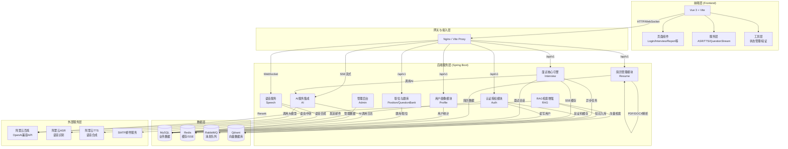
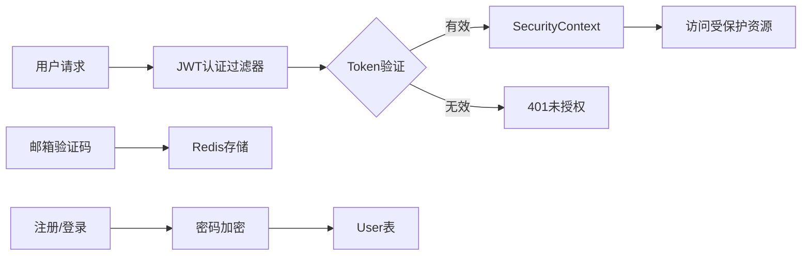
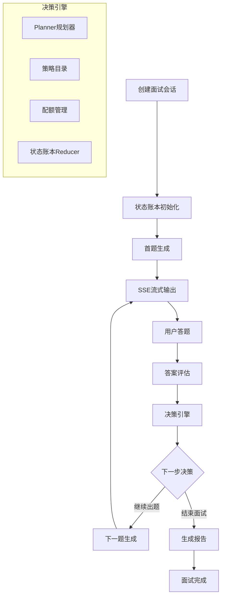
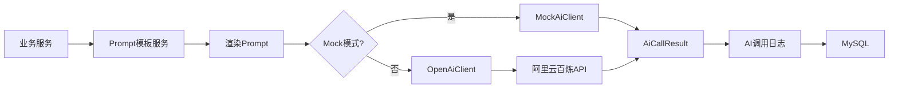
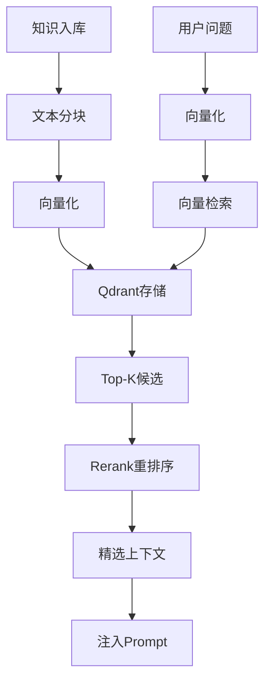
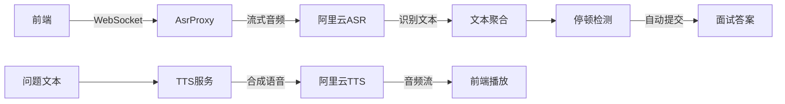
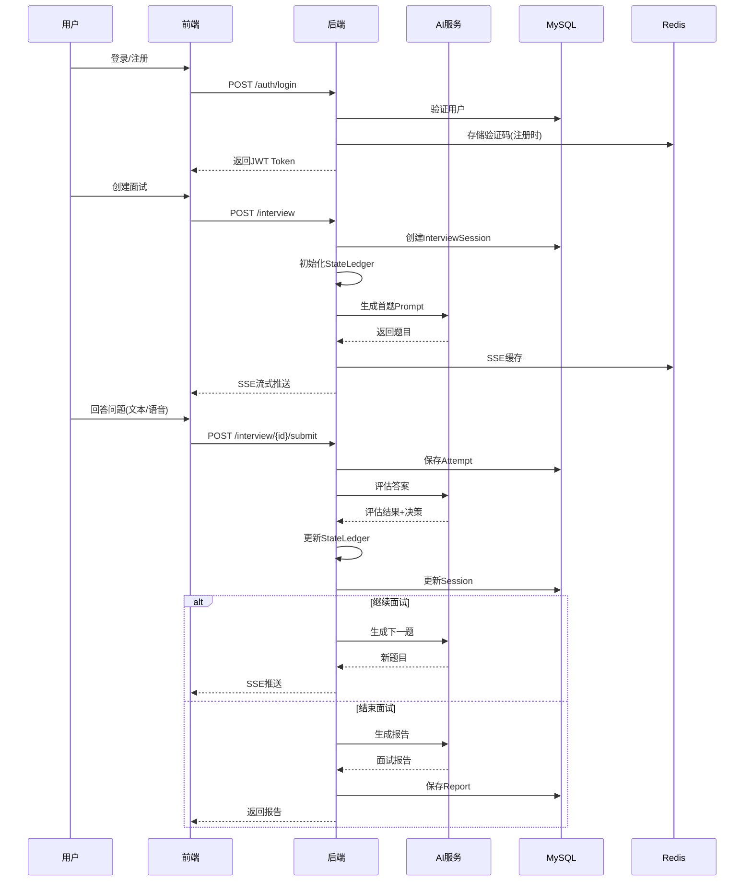
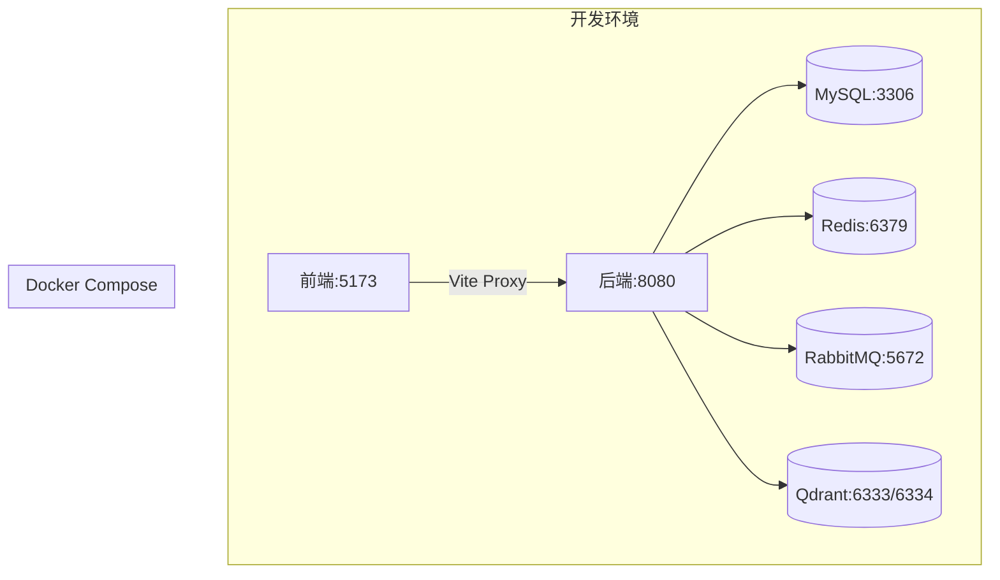

# AI 模拟面试系统架构图

## 系统整体架构

## 技术栈详解

### 前端技术栈
- **框架**: Vue 3 (Composition API)
- **构建工具**: Vite 5
- **主要特性**:
  - 组件化开发
  - Fetch API 调用
  - WebSocket/ASR 实时语音
  - SSE 流式响应

### 后端技术栈
- **核心框架**: Spring Boot 3.2.5
- **Java版本**: Java 21
- **ORM**: MyBatis-Plus 3.5.5
- **安全框架**: Spring Security + JWT
- **AI集成**: Spring AI 1.0.0
- **流式支持**: WebFlux (SSE)

### 基础设施
- **数据库**: MySQL 8.0 (业务数据)
- **缓存**: Redis (会话、SSE缓存)
- **消息队列**: RabbitMQ (异步任务)
- **向量数据库**: Qdrant (RAG知识库)

### AI与语音服务
- **大模型**: 阿里云百炼 (OpenAI兼容接口)
- **语音识别**: 阿里云ASR (Paraformer)
- **语音合成**: 阿里云TTS (CosyVoice)
- **重排序**: 阿里云Rerank (gte-rerank-v2)

## 核心模块架构

### 1. 认证授权模块 (Auth)

### 2. 面试引擎模块 (Interview)

### 3. AI服务集成模块

### 4. RAG检索增强模块

### 5. 语音服务模块

## 数据流转架构

### 完整面试流程

## 部署架构

## 核心设计模式

1. **分层架构**: Controller → Service → Mapper/Repository
2. **状态机模式**: 面试会话状态管理
3. **策略模式**: AI决策策略可插拔
4. **事件驱动**: 异步任务通过RabbitMQ
5. **流式处理**: SSE/WebSocket实时交互
6. **RAG模式**: 检索增强生成

---

*注: 此架构图可在支持Mermaid的Markdown编辑器中查看渲染效果*
