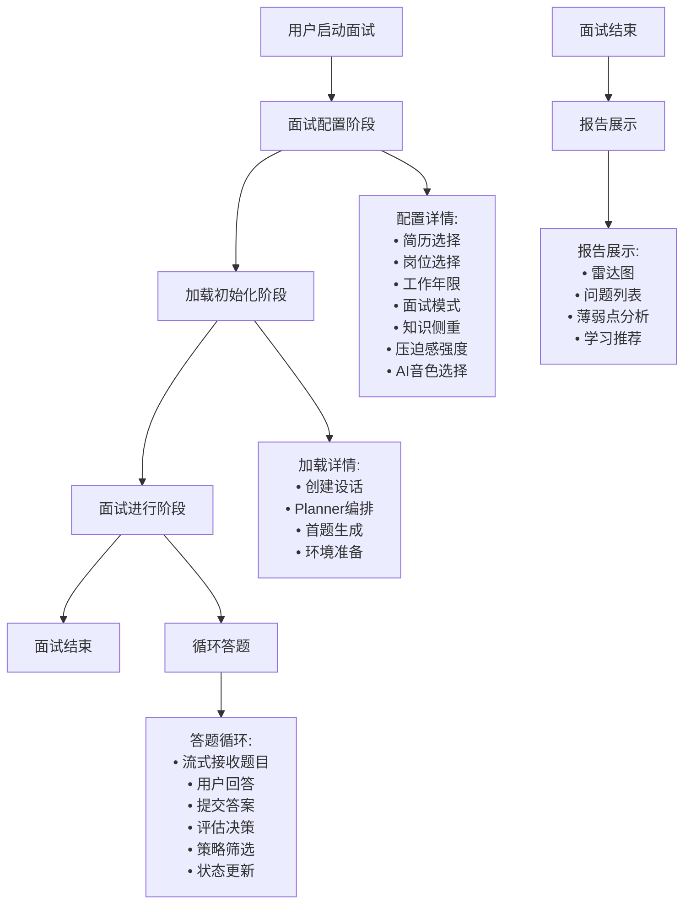
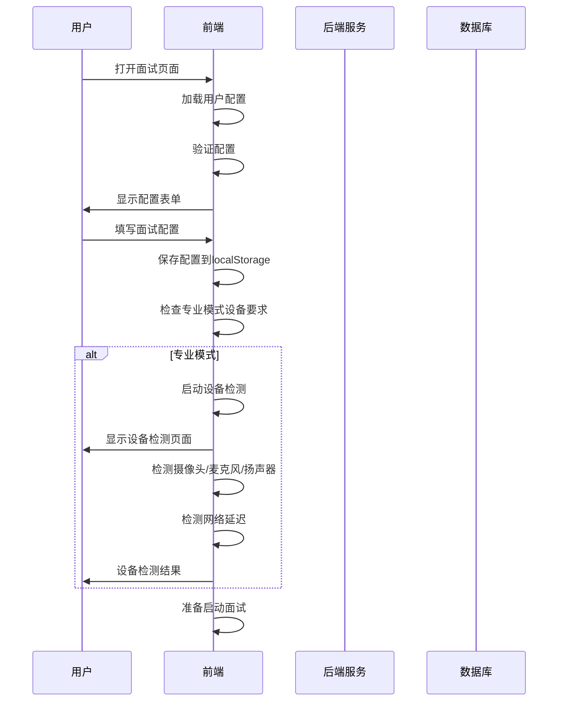
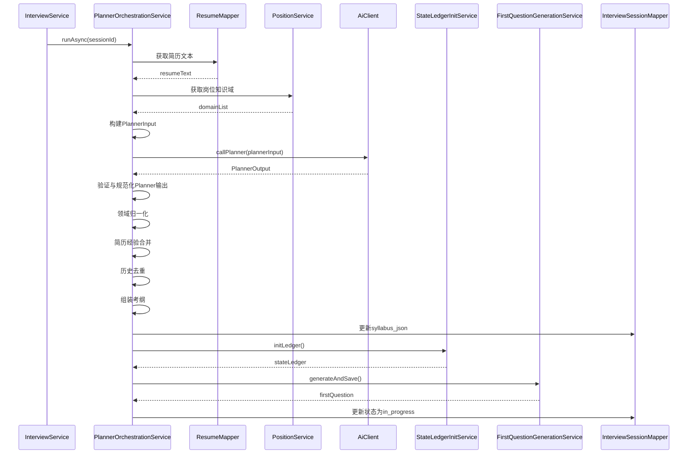
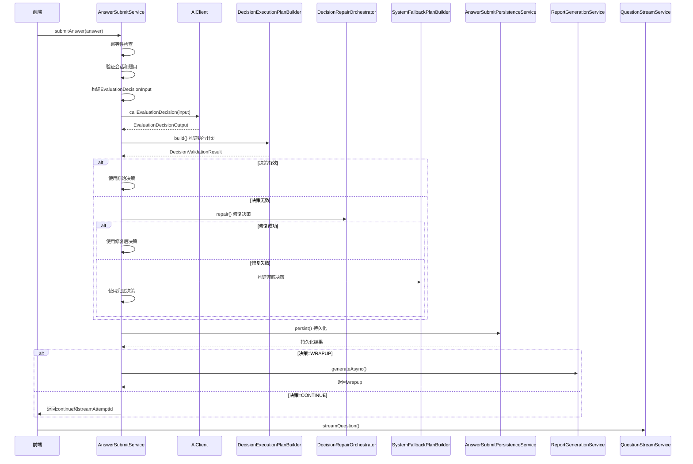
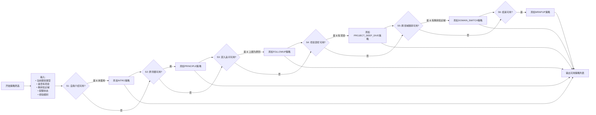
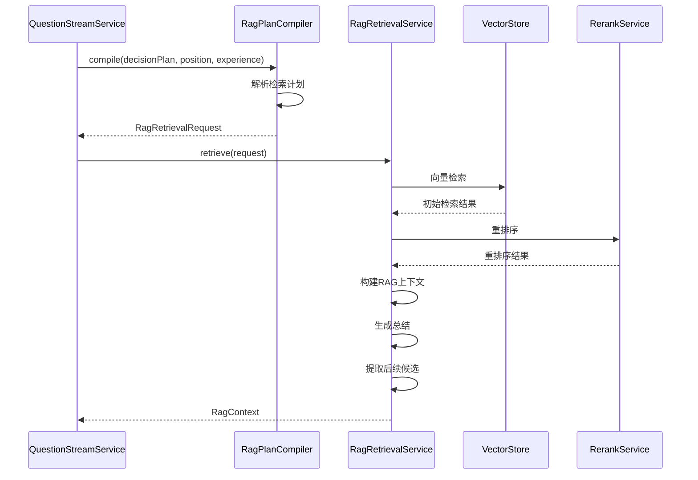
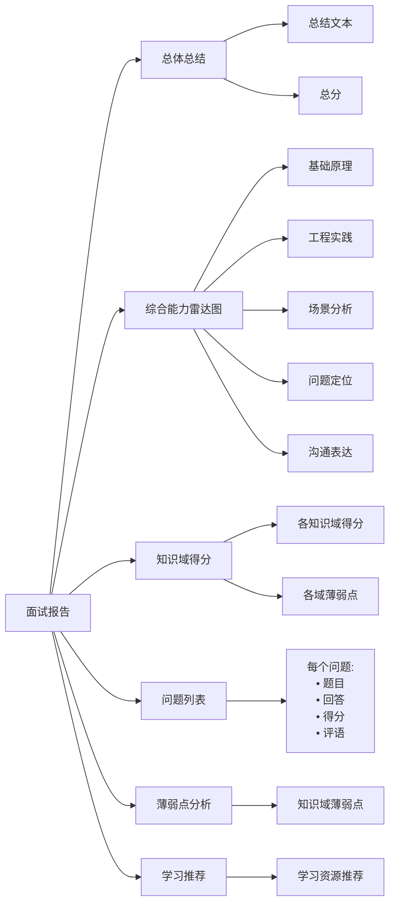

# 面试完整链路流程图

## 1. 整体流程图概览



## 2. 面试配置阶段



### 2.1 配置参数说明

| 配置项 | 说明 | 数据流向 |
|---------|------|----------|
| 简历选择 | resumeId | 用于Planner分析用户背景，影响题目生成 |
| 岗位选择 | positionCode | 确定岗位知识域，影响题目类型 |
| 工作年限 | experienceLevel | 影响题目难度和策略筛选 |
| 面试模式 | interviewMode | 练习/专业模式，影响TTS/ASR配置 |
| 知识侧重 | focusTopics | 影响Planner出题重点 |
| 压迫感 | pressure | 影响面试官语气和出题节奏 |

## 3. 会话创建与初始化阶段

```mermaid
flowchart TB
    Start[开始初始化] --> CreateSession[创建面试会话]
    CreateSession --> Validate[参数校验]
    Validate --> Resume[简历校验]
    Resume --> Save[保存会话]
    Save --> Preference[保存用户偏好]
    Preference --> Async[异步触发Planner]
    Async --> Polling[前端轮询会话状态]

    CreateSession --> |POST /interviews| CreateSession

    Async --> PlannerOrch[PlannerOrchestrationService]
    
    PlannerOrch --> Step1[1. 获取简历文本]
    Step1 --> Step2[2. 获取岗位知识域]
    Step2 --> Step3[3. 调用AI Planner]
    Step3 --> Step4[4. 保存考纲syllabus_json]
    Step4 --> Step5[5. 初始化状态账本state_ledger_json]
    Step5 --> Step6[6. 生成首题]
    Step6 --> Step7[7. 更新状态为in_progress]
    Step7 --> Done[完成初始化]

    Polling --> |GET /interviews/{sessionId}| GetDetail
    GetDetail --> Check{状态检查
    Check --> |status=planning?| Polling
    Check --> |status=in_progress| GoToInterview[进入面试]
    Check --> |status=aborted| Error[初始化失败]
```

### 3.1 Planner编排详细流程



## 4. 面试进行阶段核心流程

```mermaid
flowchart TB
    Start[进入面试] --> SSE[建立SSE连接]
    SSE --> Receive[接收首题]
    Receive --> Show[展示题目]
    Show --> Answer[用户答题]
    Answer --> Submit[提交答案]
    
    Submit --> |POST /attempts| SubmitAttempt
    SubmitAttempt --> Idempotent{幂等性检查}
    Idempotent --> |已存在| ReturnExisting[返回已存在结果]
    Idempotent --> |不存在| ValidateSession[验证会话]
    
    ValidateSession --> ValidateQuestion[验证题目]
    ValidateQuestion --> BuildEvalInput[构建评估决策输入]
    BuildEvalInput --> |包含:
    • 会话信息
    • 当前题目
    • 历史题目
    • 历史回答
    • 用户答案
    • 剩余知识域
    • 配额状态
    • 可用策略
    
    BuildEvalInput --> CallEval[调用AI评估决策]
    CallEval --> Resolve{决策解析与修复]
    Resolve --> |有效| UseRaw[使用原始决策]
    Resolve --> |无效| Repair[决策修复]
    Resolve --> |修复失败| Fallback[系统兜底策略]
    
    UseRaw --> Persist[持久化回答]
    Repair --> Persist
    Fallback --> Persist
    
    Persist --> Decision{决策类型}
    Decision --> |WRAPUP| GenerateReport[生成报告]
    Decision --> |CONTINUE| NextQuestion[生成下一题]
    
    NextQuestion --> |SSE流| StreamQuestion
    GenerateReport --> Finish[面试结束]
    StreamQuestion --> Receive
```

### 4.1 评估决策与策略筛选详细流程



### 4.2 策略筛选机制



### 4.3 状态账本更新策略

```mermaid
flowchart TB
    Start[开始状态更新] --> Input[输入:
    • 决策执行计划
    • 当前状态账本
    • 历史题目]
    
    Input --> Quota[更新配额状态]
    Quota --> |advance()| QuotaUpdate{更新类型}
    QuotaUpdate --> |原则题| UpdatePrinciple[原则题计数+1]
    QuotaUpdate --> |项目题| UpdateProject[项目题计数+1]
    QuotaUpdate --> |追问| UpdateFollowup[追问计数+1]
    QuotaUpdate --> |领域跳转| UpdateSwitch[领域跳转计数+1]
    
    UpdatePrinciple --> Covered[更新已覆盖知识点]
    UpdateProject --> Covered
    UpdateFollowup --> Covered
    UpdateSwitch --> Covered
    
    Covered --> |添加新覆盖的知识点
    Covered --> |添加新覆盖的领域|
    
    Covered --> Active[更新活动项]
    Active --> |设置active_item_key
    Active --> |设置active_item_type
    Active --> |设置active_item_name
    
    Active --> Asked[更新题目计数+1]
    Asked --> |asked_total+1
    
    Asked --> Rotation[更新轮换索引]
    Rotation --> |用于兜底策略轮换
    
    Rotation --> Save[保存状态账本]
    Save --> |更新session.state_ledger_json
    Save --> |更新session.current_question_no
```

## 5. 流式题目生成流程（含RAG接入）

```mermaid
flowchart TB
    Start[开始流式生成] --> CheckCache{检查Redis缓存}
    CheckCache --> |status=done| ReplayDone[回放已完成流]
    CheckCache --> |status=error| ReplayError[回放错误]
    CheckCache --> |status=streaming| ReplayFollow[回放+尾随]
    CheckCache --> |无缓存| NewStream[启动新流]
    
    NewStream --> Validate[验证权限]
    Validate --> Extract[提取下一题计划]
    Extract --> RAG{是否需要RAG?
    RAG --> |是| RagRetrieve[RAG检索]
    RAG --> |否| BuildGenInput[构建题目生成输入]
    
    RagRetrieve --> |RagPlanCompiler.compile()| CompilePlan[编译检索计划]
    CompilePlan --> |RagRetrievalService.retrieve()| Retrieve[执行检索]
    Retrieve --> |返回检索结果| BuildGenInput
    
    BuildGenInput --> LockCache[锁定Redis缓存]
    LockCache --> ClearCache[清除旧缓存]
    ClearCache --> Background[后台启动后台生成]
    
    Background --> |AiClient.callQuestionGenerationStream()| StreamGen[流式生成token]
    StreamGen --> OnToken{每个token到达}
    
    OnToken --> FullText[追加到完整文本]
    OnToken --> Sentence[句子缓冲]
    OnToken --> RedisPush[推送到Redis chunks]
    OnToken --> ChunkIndex[chunk索引+1]
    
    Sentence --> Closed{句子闭合?}
    Closed --> |是| TTS[触发分段TTS]
    Closed --> |否| Continue[继续缓冲]
    TTS --> TTSReady[发送tts_ready事件]
    
    StreamGen --> OnError{发生错误}
    OnError --> |有部分流| SavePartial[保存部分流]
    OnError --> |无部分流| FallbackQ[生成兜底题]
    
    StreamGen --> OnDone{流完成}
    OnDone --> Flush[刷新剩余句子]
    Flush --> SaveQ[保存题目到数据库]
    SaveQ --> UpdateSession[更新会话状态]
    UpdateSession --> DoneEvent[发送done事件]
    DoneEvent --> CacheDone[缓存done状态]
```

### 5.1 RAG检索详细流程



### 5.2 SSE事件格式说明

| 事件类型 | 说明 | 数据内容 |
|---------|------|---------|
| start | 流开始 | generationId, sessionId |
| delta | token片段 | 文本片段, chunk索引 |
| tts_ready | 语音片段就绪 | 音频URL, 段索引 |
| done | 流完成 | 完整题目快照, 总token数, TTS就绪状态 |
| error | 错误 | 错误码, 错误信息 |

## 6. 面试结束与报告生成流程

```mermaid
flowchart TB
    Start[用户结束面试] --> FEFinish[前端调用finish]
    FEFinish --> |POST /finish| BEFinish[后端finishAndGenerateReport]
    BEFinish --> UpdateStatus[更新会话状态为report_generating]
    UpdateStatus --> AsyncReport[异步触发报告生成]
    AsyncReport --> PollReport[前端轮询报告]
    
    PollReport --> |GET /report| GetReport[获取报告]
    GetReport --> CheckReport{报告状态?}
    CheckReport --> |生成中| PollAgain[继续轮询]
    CheckReport --> |已生成| ShowReport[显示报告]
    
    AsyncReport --> RGS[ReportGenerationService]
    RGS --> BuildInput[构建报告生成输入]
    BuildInput --> |包含:
    • 会话信息
    • 所有题目
    • 所有回答
    • 状态账本|
    BuildInput --> CallAI[调用AI生成报告]
    CallAI --> ParseReport[解析报告输出]
    ParseReport --> SaveReport[保存报告]
    SaveReport --> UpdateSessionStatus[更新会话状态为completed]
```

### 6.1 报告数据结构



## 7. 完整时间线流程图

```mermaid
gantt
    title 面试完整链路时间线
    dateFormat  X
    axisFormat  %s
    
    section 用户操作
    配置面试           :a1, 0, 5
    设备检测(专业模式) :a2, after a1, 3
    回答问题1          :a3, after a4, 8
    回答问题2          :a4, after a3, 8
    查看报告           :a5, after a8, 5
    
    section 前端
    提交配置           :b1, 0, 1
    轮询会话状态       :b2, after b1, 4
    SSE接收首题       :b3, after b2, 2
    SSE接收题2        :b4, after b6, 2
    轮询报告           :b5, after b8, 3
    
    section 后端服务
    创建会话           :c1, 0, 1
    Planner编排        :c2, 1, 3
    首题生成           :c3, 3, 2
    评估答案1          :c4, after c3, 2
    题2生成            :c5, after c4, 2
    评估答案2          :c6, after c5, 2
    报告生成           :c7, after c6, 3
    
    section AI
    Planner调用           :d1, 1, 2
    首题生成流         :d2, 3, 2
    评估决策1          :d3, after d2, 1
    题2生成流          :d4, after d3, 2
    评估决策2          :d5, after d4, 1
    报告生成           :d6, after d5, 2
    
    section 数据库
    保存会话           :e1, 0, 1
    保存考纲           :e2, 2, 1
    保存首题           :e3, 4, 1
    保存答案1          :e4, after e3, 1
    保存题2            :e5, after e4, 1
    保存答案2          :e6, after e5, 1
    保存报告           :e7, after e6, 1
```



## 8. 关键技术点总结

### 8.1 Agent调用链路
- **Planner调用**：创建面试时调用，生成考纲和首题
- **EvaluationDecision调用**：每次提交答案后调用，评估答案并决定下一步
- **QuestionGeneration调用**：流式生成题目
- **ReportGeneration调用**：面试结束后生成报告

### 8.2 RAG接入点
- **题目生成前**：根据决策计划检索相关知识点
- **检索流程**：编译检索计划 → 向量检索 → 重排序 → 构建上下文
- **容错处理**：RAG失败时回退到空上下文，不影响主流程

### 8.3 状态更新策略
- **配额管理**：跟踪各类题目数量
- **知识点覆盖**：记录已覆盖的知识点
- **活动项跟踪**：跟踪当前深入探讨的项目/实习项
- **轮换索引**：用于兜底策略轮换

### 8.4 缓存与容错机制
- **Redis缓存**：SSE流式数据缓存，支持断点续传
- **决策修复**：AI决策无效时的修复机制
- **系统兜底**：修复失败时的系统兜底策略
- **题目兜底**：AI题目生成失败时的兜底题目生成

## 9. 数据流汇总

| 阶段 | 输入数据 | 输出数据 | 持久化 |
|-----|---------|---------|-------|
| 配置阶段 | 面试配置 | 配置参数 | localStorage, InterviewPreference |
| 初始化阶段 | 配置参数 | sessionId | InterviewSession |
| Planner阶段 | 简历、岗位、历史 | 考纲、首题 | syllabus_json, state_ledger_json, InterviewQuestion |
| 答题阶段 | 用户答案 | 决策、下一题 | InterviewAttempt, state_ledger_json |
| 报告阶段 | 所有题目、答案 | 面试报告 | InterviewReport |
