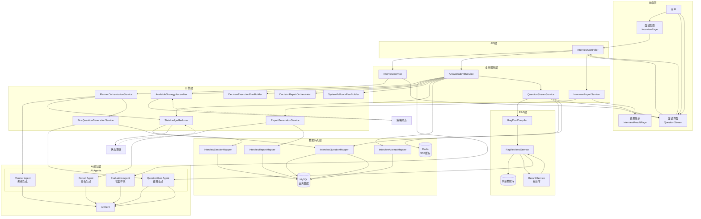
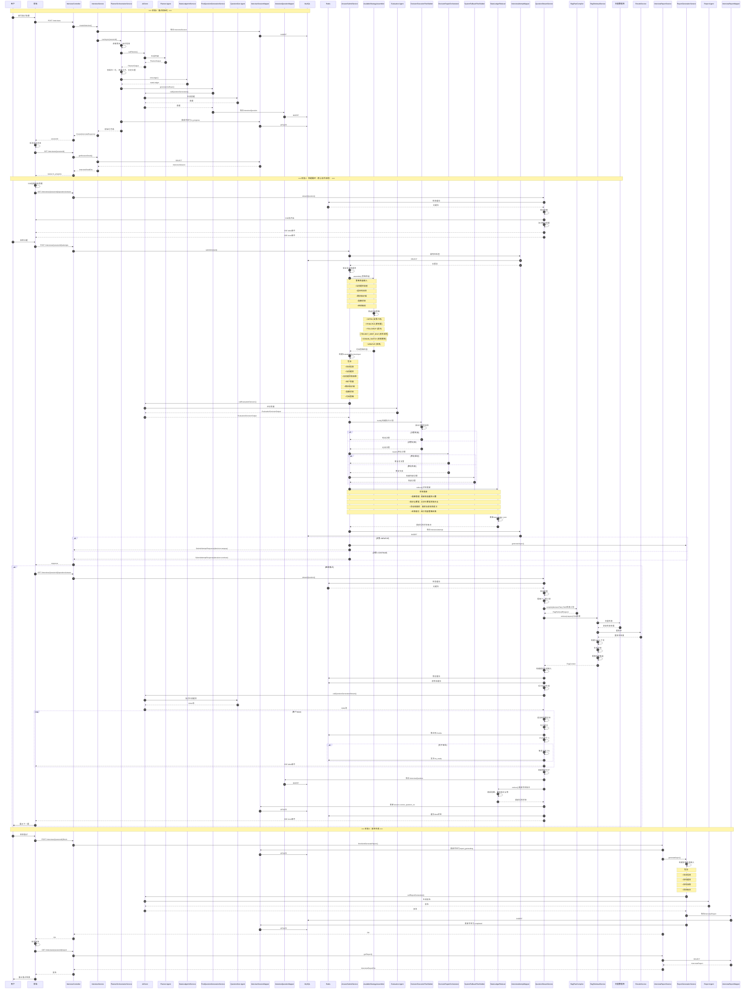
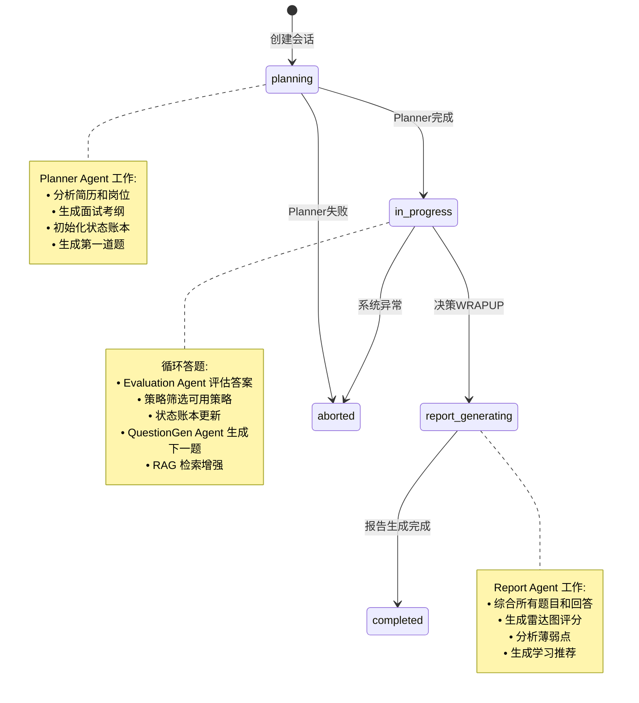
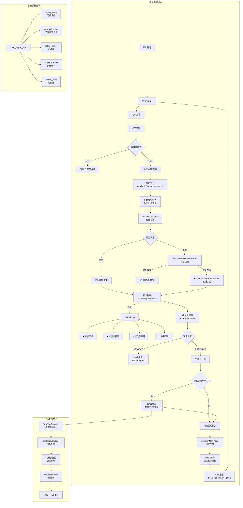
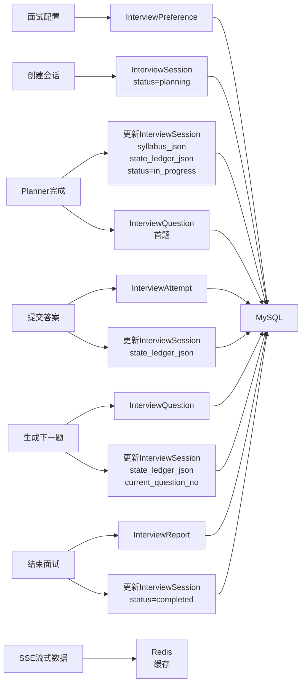

# 面试系统整体协作流程图

## 1. 系统整体架构与数据流向图



## 2. 完整的面试链路时序图（含Agent协作、RAG调用、状态更新、策略筛选）



## 3. Agent协作与状态转换全景图



## 4. 核心循环协作图（答题循环）



## 5. Agent调用与数据流向汇总表

| Agent | 调用时机 | 输入数据 | 输出数据 | 协作组件 |
|-------|---------|---------|---------|---------|
| **Planner Agent** | 创建面试时 | 简历、岗位、历史 | 考纲、首题 | PlannerOrchestrationService, StateLedgerInitService |
| **Evaluation Agent** | 每次提交答案后 | 题目、答案、历史、策略、配额 | 评估决策、下一步计划 | AnswerSubmitService, AvailableStrategyAssembler, DecisionExecutionPlanBuilder |
| **QuestionGen Agent** | 生成首题/下一题时 | 决策计划、RAG上下文、历史 | 题目（流式） | FirstQuestionGenerationService, QuestionStreamService, RagRetrievalService |
| **Report Agent** | 面试结束后 | 所有题目、答案、状态账本 | 面试报告 | ReportGenerationService |

## 6. RAG接入与数据流向

| 环节 | RAG动作 | 输入 | 输出 | 失败处理 |
|-----|---------|------|------|---------|
| **检索计划编译** | RagPlanCompiler.compile() | 决策计划、岗位、经验 | RagRetrievalRequest | 跳过RAG，不影响主流程 |
| **向量检索** | RagRetrievalService.retrieve() | RagRetrievalRequest | 初始检索结果 | 回退到空上下文 |
| **重排序** | RerankService.rerank() | 初始检索结果 | 重排序结果 | 使用初始结果 |
| **上下文构建** | 构建RAG上下文 | 重排序结果 | RagContext（总结+材料+候选） | 使用空上下文 |

## 7. 策略筛选与状态更新关键数据

### 7.1 策略筛选输入输出

| 输入参数 | 说明 | 输出策略 |
|---------|------|---------|
| 当前题目类型 | 当前题目的类型（PRINCIPLE等） | INTRO - 自我介绍（未使用） |
| 是否有项目 | 是否有项目经验 | PRINCIPLE - 原则题（配额未满） |
| 剩余知识域 | 未覆盖的知识域列表 | FOLLOWUP - 深入追问（上题为原则） |
| 配额状态 | 各类题目已用数量 | PROJECT_DEEP_DIVE - 项目深挖（有项目） |
| 经验级别 | 用户经验级别 | DOMAIN_SWITCH - 领域跳转（有剩余域） |
| | | WRAPUP - 结束（配额已满） |

### 7.2 状态更新数据项

| 状态项 | 说明 | 更新时机 |
|-------|------|---------|
| quota_state | 各类题目配额计数 | 每次生成新题后 |
| covered_points | 已覆盖的知识点列表 | 每次评估答案后 |
| covered_domains | 已覆盖的知识域列表 | 每次评估答案后 |
| active_item_key | 当前活动项key | 切换到新项目时 |
| active_item_type | 当前活动项类型 | 切换到新项目时 |
| active_item_name | 当前活动项名称 | 切换到新项目时 |
| rotation_index | 兜底策略轮换索引 | 使用兜底策略后 |
| asked_total | 总题数 | 每次生成新题后 |

## 8. 完整数据持久化流向



## 9. 缓存与容错机制全景

```mermaid
flowchart TB
    subgraph 缓存层
        Redis_Cache[Redis缓存]
        Redis_Cache --> SSE_Status[sse:gen:{id}:status]
        Redis_Cache --> SSE_Chunks[sse:gen:{id}:chunks]
        Redis_Cache --> SSE_QuestionId[sse:gen:{id}:questionId]
        Redis_Cache --> SSE_TTS[sse:gen:{id}:ttsReady]
        Redis_Cache --> SSE_Done[sse:gen:{id}:donePayload]
        Redis_Cache --> SSE_Error[sse:gen:{id}:errorPayload]
    end

    subgraph 容错层
        Idempotent_Check[幂等性检查]
        Decision_Validation[决策验证]
        Decision_Repair[决策修复<br>DecisionRepairOrchestrator]
        System_Fallback[系统兜底<br>SystemFallbackPlanBuilder]
        Question_Fallback[题目兜底<br>兜底题生成]
        RAG_Fallback[RAG容错<br>空上下文回退]
    end

    subgraph 数据流
        Start1[答题提交] --> Idempotent_Check
        Idempotent_Check --> |已存在| Return_Cached[返回缓存结果]
        Idempotent_Check --> |不存在| Eval_AI[调用Evaluation Agent]
        
        Eval_AI --> Decision_Validation
        Decision_Validation --> |有效| Use_Raw[使用原始决策]
        Decision_Validation --> |无效| Decision_Repair
        
        Decision_Repair --> |修复成功| Use_Repaired[使用修复决策]
        Decision_Repair --> |修复失败| System_Fallback
        
        Use_Raw --> Update_State[更新状态]
        Use_Repaired --> Update_State
        System_Fallback --> Update_State
        
        Start2[题目生成] --> RAG_Check{需要RAG?}
        RAG_Check --> |是| RAG_Retrieve[RAG检索]
        RAG_Retrieve --> RAG_Fallback
        RAG_Fallback --> Build_Input[构建生成输入]
        RAG_Check --> |否| Build_Input
        
        Build_Input --> QGen_AI[调用QuestionGen Agent]
        QGen_AI --> QGen_Error{出错?}
        QGen_Error --> |是| Question_Fallback
        QGen_Error --> |否| Save_Question[保存题目]
        
        Question_Fallback --> Save_Question
    end
```

## 10. 系统协作总结

### 10.1 Agent协作流程
1. **Planner Agent** → 初始化面试、生成考纲、首题
2. **Evaluation Agent** → 评估答案、决定下一步策略
3. **QuestionGen Agent** → 流式生成题目（可配合RAG）
4. **Report Agent** → 生成综合面试报告

### 10.2 RAG接入流程
1. **计划编译** → 根据决策计划确定检索目标
2. **向量检索** → 从向量库检索相关材料
3. **重排序** → 优化检索结果排序
4. **上下文构建** → 整合材料供题目生成使用

### 10.3 策略筛选机制
1. **输入参数** → 题目类型、项目、剩余域、配额、经验
2. **筛选逻辑** → 依次检查各策略可用性
3. **输出策略** → 提供可用策略列表给AI决策

### 10.4 状态更新策略
1. **配额管理** → 跟踪各类题目数量
2. **知识点覆盖** → 记录已覆盖的知识点
3. **活动项跟踪** → 跟踪当前探讨的项目
4. **轮换索引** → 用于兜底策略轮换

### 10.5 缓存与容错
1. **Redis缓存** → SSE流式数据，支持断点续传
2. **幂等性检查** → 防止重复提交
3. **决策修复** → AI决策无效时修复
4. **系统兜底** → 修复失败时使用兜底策略
5. **题目兜底** → AI题目生成失败时使用兜底题
6. **RAG容错** → RAG失败时回退到空上下文
